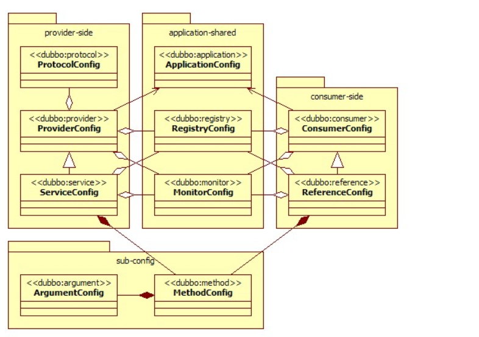
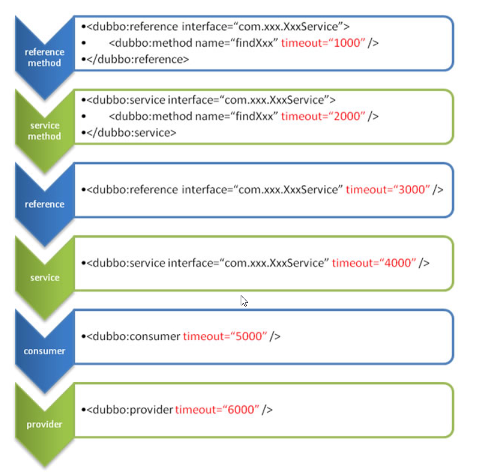

[toc]

- [1. Dubbo的配置类型](#1-dubbo的配置类型)
- [2. Config对象之间的关系](#2-config对象之间的关系)
- [3. 同一配置方式下，不同粒度配置的覆盖关系](#3-同一配置方式下不同粒度配置的覆盖关系)

#### 1. Dubbo的配置类型

在Dubbo中，配置以一个个Config对象的形式存在，不管我们采用什么方式来配置Dubbo，Dubbo最终都为将其转换为一个个Config对象

Dubbo的配置类型，见[2. Config对象之间的关系](#2. Config对象之间的关系)

#### 2. Config对象之间的关系

* Provider里，最核心的是**ServiceConfig**，一个ServiceConfig对应一个服务

  如果一个Provider有多个服务，那么就有多个ServiceConfig

* Provider的ProviderConfig是所有ServiceConfig的共享配置

  如果一个Provider有多个服务，那么这多个服务都使用同一个ProviderConfig

* Consumer里，最核心的是 **RefenerceConfig**，一个RefenerceConfig对应一个服务调用

  一个Consumer中可以对多个不同服务的调用，那么就有多个ReferenceConfig

* Consumer的ConsumerConfig是所有ReferenceConfig的共享配置

#### 3. 同一配置方式下，不同粒度配置的覆盖关系

* 方法级>接口级>全局配置
* 如果上面一样，那么consumer>provider

