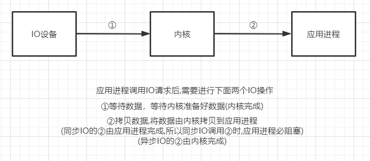
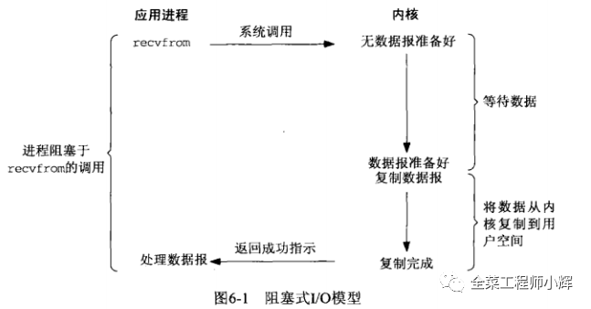
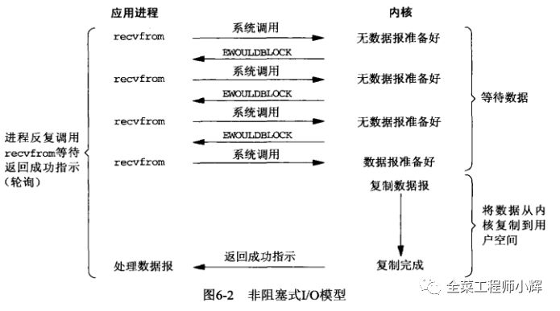
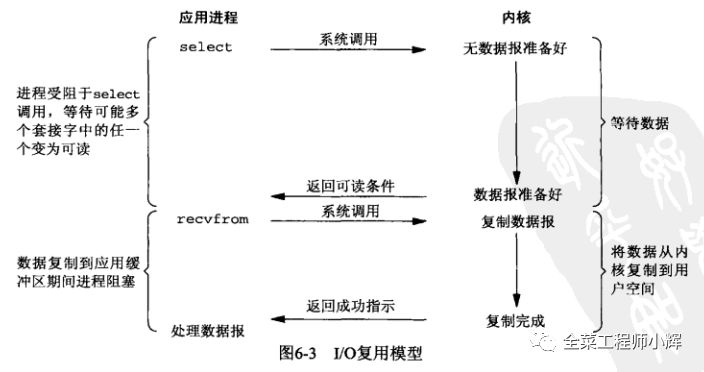
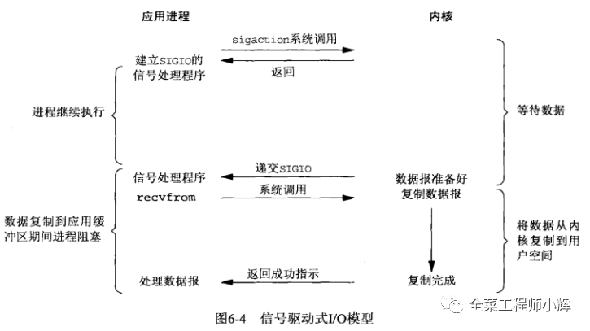
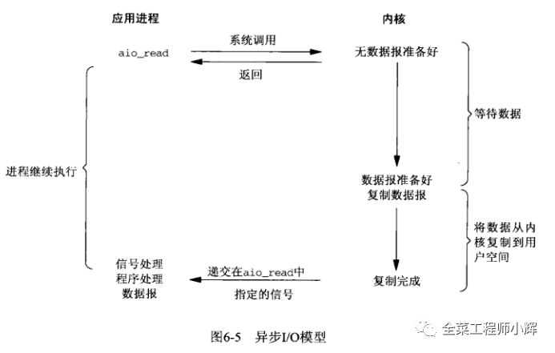
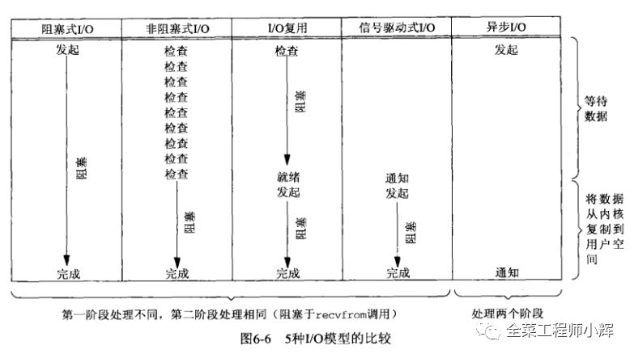

**1. IO过程**  

***
**2. IO类型**  
* 同步IO    
    * 同步阻塞IO(BIO) 
    * 同步非阻塞IO(NIO)  
    * IO复用  
    * 信号驱动IO
* 异步IO(AIO)  
*** 
**3. 各个类型的IO说明**
* **同步阻塞IO**   
  应用进程调用IO请求后,**进入阻塞状态**,等待①②的完成,①②完成后应用进程才会继续执行  
    
  

* **同步非阻塞IO**  
  应用进程调用IO请求后,立即返回,继续做自己的事情,但应用进程在做自己的事情时,仍会不断**轮询**查看①是否已经完成   
  若①完成,应用进程调用②,**进入阻塞状态**   
  
  

* **IO复用**    
  应用进程调用**select**,**进入阻塞状态**——进程监听多个Socket,直到任一个Socket变为可读   
  当某一个Socket发起连接时,内核进行①,①完成后,内核向应用进程返回**可读条件**  
  应用进程收到可读条件,**脱离阻塞状态**,调用②,**再次进入阻塞状态**    
  
  

* **信号驱动IO**   
  了解即可  
   
  

* **异步IO**  
  
  将①和②都交给内核完成   
  应用进程调用IO请求后,立即返回,内核完成①,②   
  内核完成①,②后,通知进程可以处理数据了  
  
***
**4. 五种IO模型的区别**   
* 同步IO的四种IO模型   
   * 区别在于①，但①都是由**内核完成**      
   * ②都一样,同步IO的四种IO模型的②都是**由应用进程完成**——**应用进程**将数据由内核拷贝到应用进程   
     所以同步IO的四种IO模型调用②时,都会停止当前的任务,**进入阻塞状态**,将数据由内核拷贝到应用进程
* 异步IO——①和②都交给内核完成,至始至终**都不会阻塞**     
  

  

***
**5. 同步和异步,阻塞和非阻塞**   
* 同步与异步是对应于调用者与被调用者，它们是线程之间的关系，两个线程之间要么是同步的，要么是异步的
  
  * 应用进程——调用者 ; 内核——被调用者   

  * 同步: 调用者需要等待被调用者返回结果，才会进行下一步操作   
    (需要等待内核完成①后才能进行②)  
  * 异步: 调用者不需要等待被调用者返回调用，即可进行下一步操作，被调用者通常依靠事件、回调等机制来通知调用者结果  
  (应用进程不等继续做自己的事情,将①②都交给内核完成,内核完成后通知应用进程即可)

* 阻塞与非阻塞是对同一个线程来说的，在某个时刻，线程要么处于阻塞，要么处于非阻塞   
  * 阻塞:**调用者** 调用 **被调用者**后, 调用者挂起,等待被调用者返回结果  
  * 非阻塞：**调用者** 调用 **被调用者**后,调用者不受影响,继续做自己的事情   

