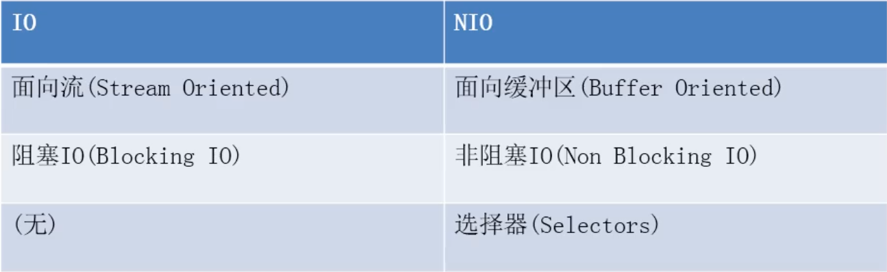

**Java支持的IO模型**  
1. JavaBIO:同步阻塞IO——一个线程处理一个客户端请求,不干其他的事情
2. JavaNIO:同步非阻塞IO+IO复用——一个线程处理多个客户端请求,多个Client发送得连接请求都会注册到多路复用器上,多路复用器轮询到连接有IO请求就进行处理  
3. JavaAIO:异步IO 
***
**IO和NIO的区别**
   
***
**Java对BIO，NIO，AIO的支持**
1. BIO：Java的io包和net包——都是面向流的 ，交互方式是 同步,阻塞的方式  
2. NIO：在Java 1.4中引入了NIO框架(java.nio 包)，提供了Channel、Selector、Buffer等新的抽象，可以构建多路复用IO程序，同时提供更接近操作系统底层的高性能数据操作方式。   
3. AIO：在Java7中，NIO有了进一步的改进，也就是NIO2，引入了异步非阻塞IO方式，也被称为AIO(Asynchronous IO)，异步IO操作基于事件和回调机制。   
