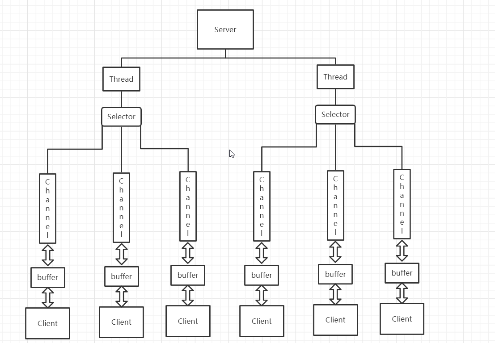

**1. JavaNIO**    

JavaNIO是面向缓冲区的,非阻塞同步IO,并且实现了多路复用
***

**2. JavaNIO三大核心**   
NIO有三大核心部分——Channel(通道),Buffer(缓冲区),Selector(选择器)    

***  
**3. JavaNIO三个核心组件关系**  
   
* 每个Channel对应一个Buffer   
* 每个Selector对应一个Thread  
* 多个Channel可以注册到同一个Selector   
* Thread切换到哪个Channel取决于事件——Selector根据事件在不同Channel上切换    

