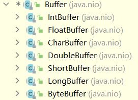
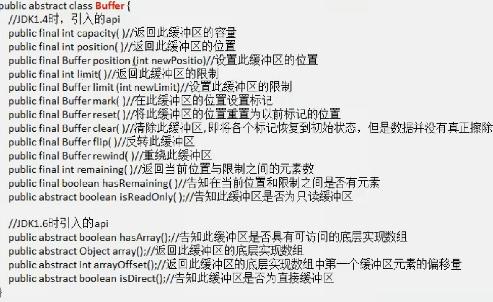
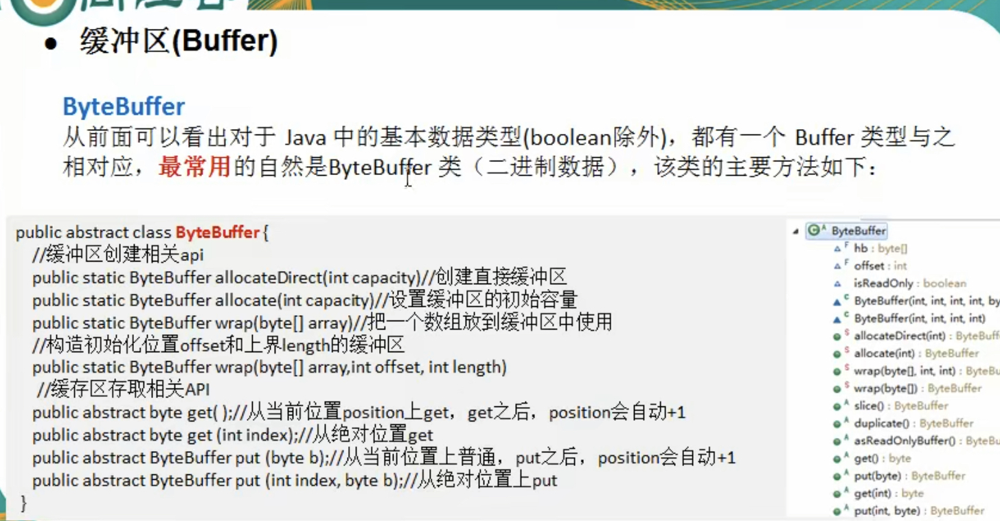

抽象父类——Buffer    
Buffer还有许多抽象子类  
        

* 每个Buffer都有一个数组用来存储数据   
Buffer定义了4个所有Buffer子类都具有的属性    
  * capacity:容量，缓冲区中最大存储数据容量，创建时确定，不能改变   
  * position:下一个要读/写的数据的索引
  * limit:限制，不能操作limit及其之后的数据(position<limit)
  * mark：标记  
```
    //写入数据后如果要读，一定要调用flip(),重置postion和limit(将limit设为写入的元素个数)
    public final Buffer flip() {
        limit = position;
        position = 0;
        mark = -1;
        return this;
    }
```

    

     


***
**直接缓冲区和非直接缓冲区**   
* 非直接缓冲区：通过allocate()创建Buffer——会将Buffer创建在JVM内存中
* 直接缓冲区： 通过allocateDirect()创建Buffer——会将Buffer建立在物理内存中，提高效率