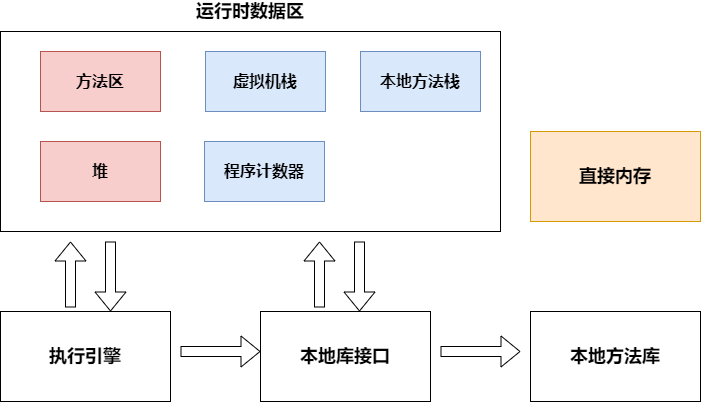

[toc]

## 0. JDK6的内存结构

## 1. 运行时数据区（内存区域）

### 1.1 堆(线程共享)——存储对象实例，由垃圾回收机制管理

#### 1.1.1 TLAB

虽然堆是线程共享的，但是每个线程可以在堆中划分出 **线程私有的分配缓冲区(Thread Local Allocation Buffer)**

### 1.2 方法区(线程共享)——也叫永久代

* **Class对象(该类的方法区中各种数据的访问入口，各种数据包含了以下信息)**  
* **运行时常量池(内含字符串常量池)**   
  存放各种字面常量，class文件中的符号引用，以及符号引用解析得到的直接引用  
* **类型信息**  
  类型的全限定名，类型父类的全限定名，类型实现的接口的全限定名，类型是类还是接口，类型的访问修饰符等
* **字段信息**  
  类中声明的所有字段(包括静态变量和实例变量，不包括局部变量)的描述(名称，类型，修饰符等)  
* **方法信息**   
  方法的 名称，返回类型，参数表，**字节码指令**，修饰符，局部变量表和操作数栈的大小，异常表  
* **静态变量**   
* **指向类加载器的引用**  
* **指向Class类对象(Class.forName()的Class)的引用**  

### 1.3 Java虚拟机栈(线程私有)

每执行一个Java方法，会往Java虚拟机栈中push一个栈帧   
一个Java方法执行完毕，其对应的栈帧从Java虚拟机栈中pop

编译java文件时，一个栈帧需要多大的局部变量表，多深的操作数栈已经被分析出来，并写入方发表的code属性中

#### 1.3.1 栈帧

* **操作数栈** 

* **局部变量表**  

  局部变量表存储了编译器可知的Java的基本数据类型，reference，returenAddress类型

  这些数据在局部变量表中以 **Slot**形式存储，除了double和long占**2个slot**，其余占**1个slot**

  JVM通过索引定位访问局部变量表，索引从0开始

* **锁记录**

* **动态连接**   
  一个指向运行时常量池中该栈帧所属的方法的引用，该引用是为了支持方法调用过程中的动态连接（常量池中的一部分符号引用会在每一次运行期间都转化为直接引用——动态连接）
  
* **方法返回地址**

### 1.4 本地方法栈(线程私有)

类似于Java虚拟机栈，不过执行的是native方法   

### 1.5 程序计数器

程序控制流的指示器

如果执行的是Java方法，程序计数器存储的是下一条字节码指令的地址  
如果执行的是本地方法，程序计数器为Undefined   

### 1.6 直接内存

直接内存并不属于运行时数据区

JDK1.4引入NIO类，引入了一种基于Channel与Buffer的I/O方式，可以使用Native函数库直接分配堆外内存(在直接内存中分配空间)，然后通过一个存储在堆中的DirectByteBuffer对象作为这块内存的引用进行操作

## 2. 执行引擎

执行引擎将字节码转换为操作系统底层指令  

## 3. 本地库接口

与本地方法库交互的接口  

## 4. 类加载系统