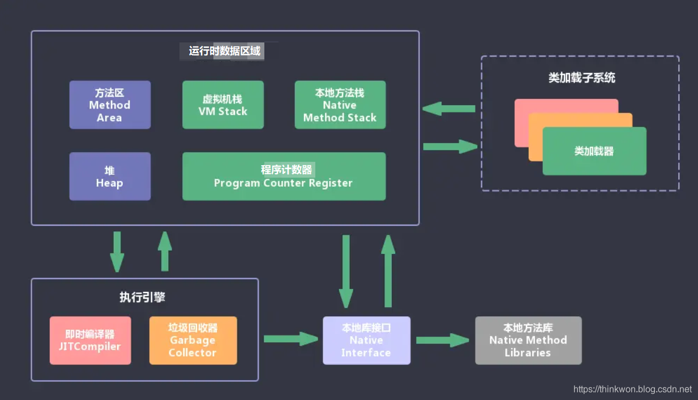

**JVM内存(JDK1.6)模型**  
* **运行时数据区(内存区域)**
  * **堆**(线程共享)——存储Class对象  
    * **老年代**
    * **新生代**
  * **方法区**(线程共享)    
    * **Class对象(该类的方法区中各种数据的访问入口，各种数据包含了以下信息)**  
    * **运行时常量池(内含字符串常量池)**   
      存放各种字面常量，class文件中的符号引用，以及符号引用解析得到的直接引用  
    * **类型信息**  
      类型的全限定名，类型父类的全限定名，类型实现的接口的全限定名，类型是类还是接口，类型的访问修饰符等
    * **字段信息**  
      类中声明的所有字段(包括静态变量和实例变量，不包括局部变量)的描述(名称，类型，修饰符等)  
    * **方法信息**   
      方法的 名称，返回类型，参数表，**字节码指令**，修饰符，局部变量表和操作数栈的大小，异常表  
    * **静态变量**   
    * **指向类加载器的引用**  
    * **指向Class类对象(Class.forName()的Class)的引用**  

  * **线程**
    * **Java虚拟机栈**   
      每执行一个Java方法，会往Java虚拟机栈中push一个栈帧   
      一个Java方法执行完毕，其对应的栈帧从Java虚拟机栈中pop
      * **栈帧**
         * 操作数栈 
         * 局部变量表  
         * 方法出口 
         * 锁记录
         * 动态链接   
           一个指向运行时常量池的引用，来支持当前方法的代码实现动态链接
    * **本地方法栈**   
      类似于Java虚拟机栈，不过执行的是native方法   
    * **程序计数器**   
      如果执行的是Java方法，程序计数器存储的是下一条字节码指令的地址  
      如果执行的是本地方法，程序计数器为Undefined   
      
* **执行引擎**   
  执行引擎将字节码转换为操作系统底层指令  
* **本地库接口**  
  与本地方法库交互的接口  
* **类加载系统** 