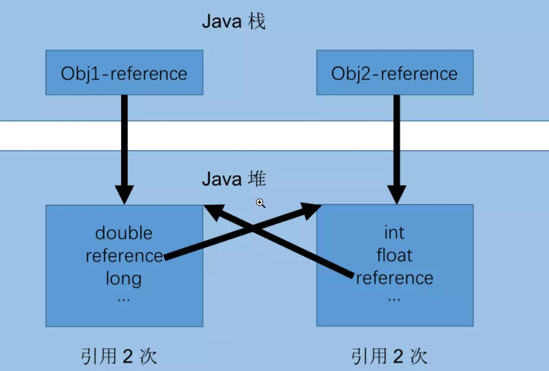
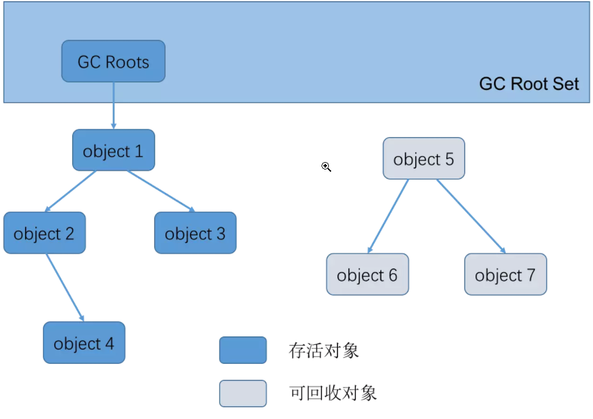

[toc]

- [**1. 判断对象已死**](#1-判断对象已死)
  - [**1.1 引用计数法**](#11-引用计数法)
  - [**1.2 可达性分析**](#12-可达性分析)
- [**2. 引用的类型**](#2-引用的类型)
- [**3. 对象被回收的条件**](#3-对象被回收的条件)
- [**4. 垃圾回收算法**](#4-垃圾回收算法)
- [**5. JVM内存空间的另一种划分方式**](#5-jvm内存空间的另一种划分方式)

### **1. 判断对象已死**   

#### **1.1 引用计数法**

给对象添加一个引用计数器，每当有一个地方引用对象，计数器值+1，当引用失效，计数器值-1。当计数器为0时，表示对象已死，但会出现以下问题   
Obj1=null,Obj2=null后，由于两个对象之间仍然相互引用，导致两个对象无法被清除   

#### **1.2 可达性分析**

‘GC Roots’ 的对象作为起始点，从这些节点出发所走过的路径称为引用链。   
当一个对象到 GC Roots 没有任何引用链相连的时候说明对象不可用

* 可以作为GC Roots对象的东西
  * Java虚拟机栈->栈帧->局部变量表->引用所指向的对象
  * 本地方法栈中->JNI->局部变量表->引用所指向的对象
  * 静态属性引用的对象
  * 常量引用的对象

  

### **2. 引用的类型** 

* #### **强引用**   
  
  类似于 Object obj = new Object(); 创建的 
  强引用不置为null的话，其指向的对象不会被回收  
* #### **软引用**   
  
  SoftReference 类实现软引用，软引用指向的对象，在内存不足时会被回收  
* #### **弱引用**  
  
  WeakReference 类实现弱引用，弱引用指向的对象，只要触发GC就会被回收  
* #### **虚引用**   
  
  PhantomReference 类实现虚引用。   
  无法通过虚引用获取一个对象的实例，  
  为一个对象设置虚引用关联的唯一目的就是能在这个对象被收集器回收时收到一个系统通知。  

### **3. 对象被回收的条件**  

对象需要经过**2次**标记，才会被GC回收

* 可达性分析，该对象没有与GC Roots相连接的引用链，进行**第一次标记**，并进行筛选  
* 筛选的标准是**该对象有没有执行finalize()的必要**   
  当对象没有覆盖 finalize() 方法，或者 finalize() 方法已经被调用过，虚拟机将这两种情况都视为“没有必要执行”   
* 如果该对象被判定为**有执行finalize()的必要**   
  那么这个对象会被放在一个叫做 F-Queue 的队列中。JVM中有个Finalizer线程。
  该线程会对F-Queue中的对象全部执行一次finalize(),并进行**第二次标记**   
  对象可以在finalize()中拯救自己——>只要重新与引用链上的一个对象相连即可    

### **4. 垃圾回收算法**  

* #### **标记-清楚算法**   
  
  将要被清清除对象进行标记，触发GC时，回收被标记的对象（也可以反过来标记存活的对象）    
  
  * 缺点
    * 执行效率不稳定
    * 非移动式，不需要移动对象，但会造成内存空间的碎片化
  
* #### **标记-复制算法**(JVM新生代使用)   
  
  将内存空间分为两块，每次只使用一块，当使用的内存块满了的时候，将该内存块中的存活对象复制到另一个内存块上，然后清空该内存块    
  
  * **JVM新生代使用的复制算法**
    空间利用率低下，因为绝大多数新生代熬不过第一轮GC，所以没必要1:1划分内存空间   
    JVM新生代采用的就是复制算法，不过新生代中，将内存空间划分为**Eden+Survivor1+Survivor2(8:1:1)**三块内存空间   
    每次只会使用Eden和一块Survivor，
    当Eden空间不足时，触发GC，将Eden和使用的Survivor中的存活对象复制到另一块Survivor上(如果存活的对象Survivor装不下，那么多出来的对象进入老年代),
    然后清空Eden和使用的Survivor  
  * 缺点
    * 对象存活率较高时，需要进行较多的复制，效率降低——不适用于老年代
    * 空间利用率低
  
* #### **标记-整理算法**(JVM老年代使用)  
  
  将存活的对象移动到内存的一端，然后将剩下的部分清除
  
  * 缺点
    * 标记-整理算法是移动式的，需要移动存活的对象，移动存活对象时必须全程暂停用户应用线程(Stop The World)

* #### **分代算法**(JVM采用的)  
  
  JVM将内存分代，不同的代采用不同的垃圾回收算法  
  
  * **新生代**——每次GC都有大量对象死去，采用上面的复制算法  
  * **老年代**——对象存活率高，采用上面的标记-整理算法  
  * **永久代**(方法区就是永久代，jdk1.8废除了永久代)     
    永久代要回收的——废弃的常量和不再使用的类(Class对象)   
    * 判断废弃常量   
      一般是判断没有该常量的引用。
    * 判断不再使用的类，必须以下**3个条件**都满足  
       * 该类的所有实例都已被回收  
       * 加载该类的ClassLoader已被回收  
       * 该类的Class对象没有被引用
  
* #### **GC名词**  
  
  * 部分收集(Partial GC)——堆的垃圾回收 
    * 新生代收集(Minor GC/Young GC)——新生代的垃圾回收  
    * 老年代收集(Major GC/Old GC)——老年代垃圾回收  
    * 混合收集(Mixed GC)——新生代和老年代的垃圾回收
  * 整堆收集(Full GC)——堆和方法区的垃圾回收

### **5. JVM内存空间的另一种划分方式**

* 堆
   * 新生代
   * 老年代
* 方法区(永久代)——JDK1.8后移除

