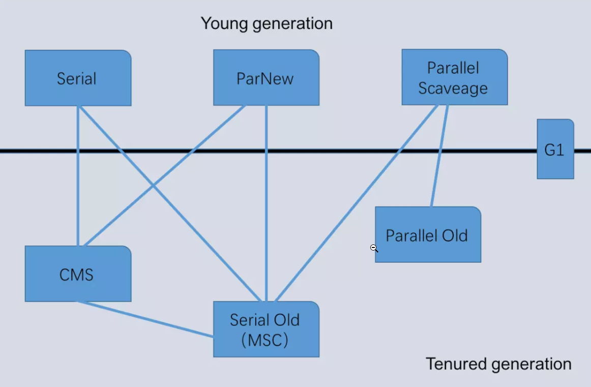

[toc]

- [**1. 新生代垃圾回收器(都是采用复制算法)**](#1-新生代垃圾回收器都是采用复制算法)
  - [**1.1 Serial**](#11-serial)
  - [**1.2 ParNew**](#12-parnew)
  - [**1.3 Parallel Scaveage**](#13-parallel-scaveage)
- [**2. 老年代垃圾回收器**](#2-老年代垃圾回收器)
  - [**2.1 Serial Old**](#21-serial-old)
  - [**2.2 Parallel Old**](#22-parallel-old)
  - [**2.3 Garbage First**](#23-garbage-first)
- [**3. 总结**](#3-总结)

如果两个收集器之间存在连线——它们可以搭配使用

**几个概念**

* **并行收集**   
  多条线垃圾回收线程并行工作，用户线程处于等待状态   
* **并发收集**  
  用户线程与垃圾回收线程同时工作   
* **Stop The World**  
  暂停所有的用户线程

### **1. 新生代垃圾回收器(都是采用复制算法)** 

#### **1.1 Serial**

* 单线程收集器，只会使用一个线程来进行完成垃圾收集工作   
 并且在进行垃圾回收时必须 **Stop The World**

* 工作原理图

   

* 适用场景  
  客户端模式下的虚拟机  

#### **1.2 ParNew**  

Serial的多线程版本，使用多个线程来完成垃圾收集工作 ，在垃圾回收时，会 **Stop The World**

#### **1.3 Parallel Scaveage**

* **并行**的多线程垃圾处理器，会触发 **Stop The World**
  
  
* 与ParNew类似，不同在于parallelScaveage可以采用GC自适应策略     

* 该收集器的目标是达到一个**可控制的吞吐量**

  

* Parallel Scavenge收集器使用2个参数控制吞吐量
  * XX:MaxGCPauseMillis ：控制最大的垃圾收集停顿时间
  * XX:GCRatio：直接设置吞吐量大小
  
* 可以开启**GC自适应调节策略**   
  **GC自适应调节策略**：Parallel Scavenge收集器可设置 **-XX：+UseAdptiveSizePolocy参数**。  
  当策略开启时，不需要手动指定新生代的大小(-Xmn),Eden和Survivor区的比例(-XX:SurvivorRation)，晋升老年代的对象年龄(-XX:PretenureSizeThreshold)等   
  虚拟机会根据系统的运行状况收集性能监控信息，动态设置这些参数以提供最优的停顿时间和最高的吞吐量

### **2. 老年代垃圾回收器**

#### **2.1 Serial Old**   

Serial的老年代版本，单线程，采用**标记-整理**算法  
  

#### **2.2 Parallel Old**    

Parallel Scaveage的老年代版本，**多线程并发收集**，采用**标记-整理**算法

#### **2.3 CMS(Concurrent Mark Sweep)**   

* 以**获取最短回收停顿时间**为目标的垃圾收集器   

* 使用**标记-清除**算法，CMS部分操作会导致Stop The World，但不会太久  

* 工作流程：
  
  
   * ①初始标记：(导致Stop The World)标记下GC Roots直接关联到的对象，速度很快
   * ②并发标记：(不会导致Stop The World，与用户线程并发)从GC Roots直接关联的对象触发，开始遍历整个对象图，耗时长，但不会 **Stop The World**
   * ③重新标记：(导致Stop The World)并发标记期间，用户程序继续运作，可能会导致部分对象的标记变动，重新标记就是为了修正这些对象的标记记录
   * ④并发清除：(不会导致Stop The World)清除掉标记为已经死亡的对象，由于不会移动存活对象，所以用户线程不必暂停
  
* 优点

  * 并发收集，有多个回收线程
  * 低停顿

* 缺点

  * 对处理器资源十分敏感，会占用一部分处理器资源而导致应用程序变慢

    CMS默认启动的回收线程数=(处理器核心数量+3)/4

  * CMS无法清除浮动垃圾，可能导致GC阶段，用户线程继续运行，耗尽老年代内存，导致一次 **Stop The World**的 **GC**

    * **浮动垃圾（并发标记阶段和并发清除阶段，程序继续运行，会继续产生垃圾，但这些垃圾没有被标记到，无法被处理，只能留到下一次GC，这些垃圾就是浮动垃圾）**

    * 由于CMS进行GC时，大多数时候用户线程扔继续运行，就必须在老年代预留足够的内存空间给用户线程使用，所以CMS不是等老年代内存空间没了才开始GC，而是当老年代内存空间使用了一定比例后开始GC，这种会出现一种情况，当CMS启动GC时，预留了一定比例的内存，但在CMS执行GC的过程中，用户线程继续执行，耗尽了预留的内存，就会出现 **并发失败(Concurrent Mode Failure)**，这时JVM会临时启动Serial Old收集器进行老年代的垃圾收集，会 **Stop The World**

  * CMS采用 **标记-清除算法**，会产生大量空间碎片

#### **2.4 Garbage First**   

* **面向服务端应用**的垃圾收集器   
* 对堆中的任何部分进行垃圾回收(MixedGC模式)  
* G1基于 **Region**的堆内存布局，Region是单词回收的最小单元，每次收集到的内存空间都是Region大小的整数倍
* 处理思路：让G1根据各个region回收所获得的空间大小以及回收所需时间，维护一个优先级列表，每次根据用户设定允许的收集停顿时间，优先处理回收收益最大的Region

* G1把堆划分为多个大小相当的 **Region**，每个Region都可以根据需要，扮演新生代的Eden，Survivor，老年代，G1收集器对扮演不同角色的Region采用不同的策略去处理

* Region中还有 **Humongous区域**——专门用存储大对象（大小超过一个Region容量的一般就是大对象），对于唱过整个Region容量的超大对象，存放在N个连续的Humongous Region中（G1把Humongous当作老年代的一部分看待）

### **3. 总结**   

