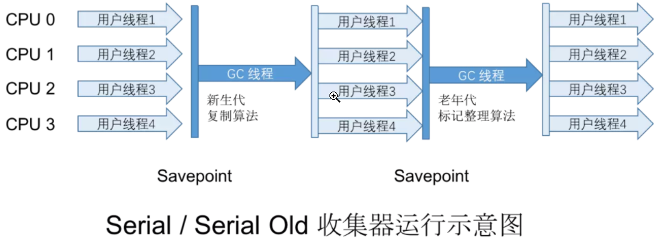
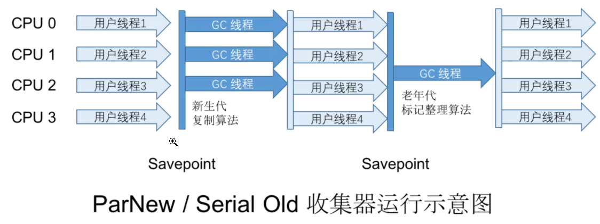
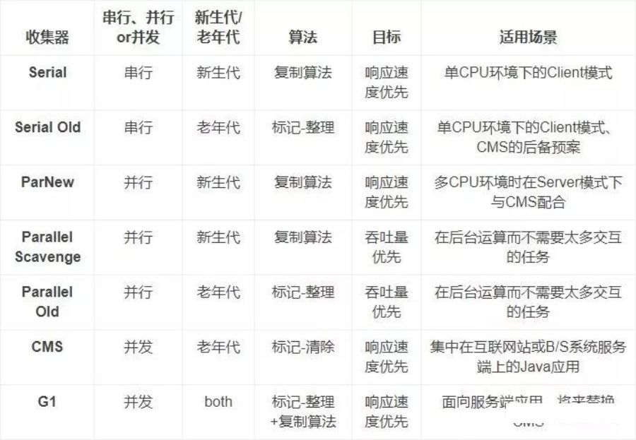

     
**几个概念**
* **并行收集**   
  多条线垃圾回收线程并行工作，用户线程处于等待状态   
* **并发收集**  
  用户线程与垃圾回收线程同时工作   
  
* **Stop The World**  
  暂停所有的用户线程

**1. 新生代垃圾回收器(都是采用复制算法)** 
* **Serial**   
  * 单线程收集器，只会使用一个线程来进行完成垃圾收集工作   
   并且在进行垃圾回收时必须暂停其它所有的用户线程直到收集结束。  
  * 适用场景  
    客户端模式下的虚拟机  
    

* **ParNew**   
  Serial的多线程版本，使用多个线程来完成垃圾收集工作   
  并且在进行垃圾回收时必须暂停其他所有的用户线程直到收集结束。  
  

* **Parallel Scaveage**      
  * 并行的多线程垃圾处理器，也会暂停所有的用户线程
    
  * 与ParNew类似，不同在于parallelScaveage可以采用GC自适应策略     
  * 该收集器的目标是达到一个**可控制的吞吐量**
  * Parallel Scavenge收集器使用2个参数控制吞吐量
    * XX:MaxGCPauseMillis ：控制最大的垃圾收集停顿时间
    * XX:GCRatio：直接设置吞吐量大小
     
  * 可以开启**GC自适应调节策略**   
  **GC自适应调节策略**：Parallel Scavenge收集器可设置 **-XX：+UseAdptiveSizePolocy参数**。  
    当策略开启时，不需要手动指定新生代的大小(-Xmn),Eden和Survivor区的比例(-XX:SurvivorRation)，晋升老年代的对象年龄(-XX:PretenureSizeThreshold)等   
    虚拟机会根据系统的运行状况收集性能监控信息，动态设置这些参数以提供最优的停顿时间和最高的吞吐量

**2. 老年代垃圾回收器**
* **Serial Old**   
  Serial的老年代版本，单线程，采用**标记-整理**算法  
    
  

* **Parallel Old**    
  ParallelScaveage的老年代版本，多线程，采用**标记-整理**算法
  

* **CMS**   
  * 以**获取最短回收停顿时间**为目标的垃圾收集器   
  * 使用**标记-清除**算法，CMS部分操作会导致Stop The World，但不会太久  
  * 工作流程：
    
    
     * ①初始标记：(导致Stop The World)标记下GC Roots直接关联到的对象  
     * ②并发标记：(不会导致Stop The World，与用户线程并发)从GC Roots直接关联的对象触发，开始遍历整个对象图  
     * ③重新标记：(导致Stop The World)并发标记期间，用户程序继续运作，可能会导致部分对象的标记变动，重新标记就是为了修正这些对象的标记记录
     * ④并发清楚：(不会导致Stop The World，与用户线程并发)清除掉标记为已经死亡的对象，由于不会移动存货对象，所以用户线程不必暂停

**3. 特殊的收集器**   
* **Garbage First**   
  * 面向服务端应用的垃圾收集器   
  * 对堆中的任何部分进行垃圾回收(MixedGC模式)  
  

**总结**   

