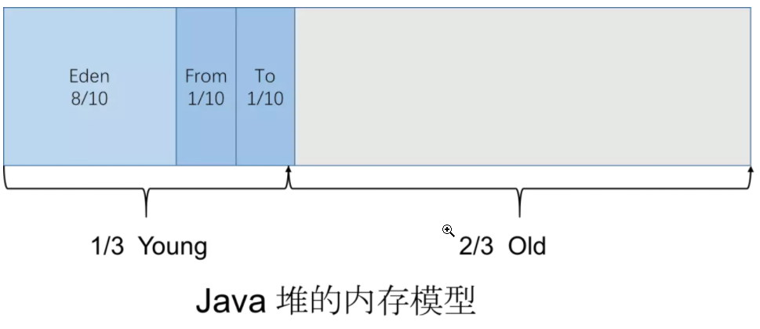

* Java堆的内存模型  
     
  
* 对象优先分配在Eden中，如果Eden没有足够的空间，那么进行一次MinorGC  
* 大对象直接进入老年代(例如很长的字符串or元素数量很庞大的数组)  
* 长期存活的对象进入老年代   
  JVM给每个对象定义了一个年龄计数器(Age)，存储在对象头中   
  对象通常在Eden中诞生，如果经过一次MinorGC后，对象仍存活   
  如果对象不能被Survivor容纳，那么直接进入老年代  
  如果对象能被Survivor容纳，那么进入Survivor，Age设为1，对象在Survivor中每熬过一次MinorGC，Age到达一定值(默认15),进入老年代  
  
* 动态年龄判定  
  如果Survivor中Age=x的对象的总大小>Survivor的一半，那么Age>=x的对象都进入老年代   
  
* 空间分配担保   
  发生MinorGC钱，JVM先检查老年代最大可用的连续空间 是否> 新生代所有对象总空间   
  * 如果成立，那么这次MinorGC安全
  * 如果不成立，JVM查看-XX:HandlePromotionFailure参数，判断是否允许担保失败   
     * 如果允许，检查老年代最大可用的连续空间 是否> 历次晋升到老年代对象的平均大小  
       * 如果大于，尝试一次MinorGC
       * 否则，进行一次FullGC  
     * 如果不允许，进行一次FullGC
