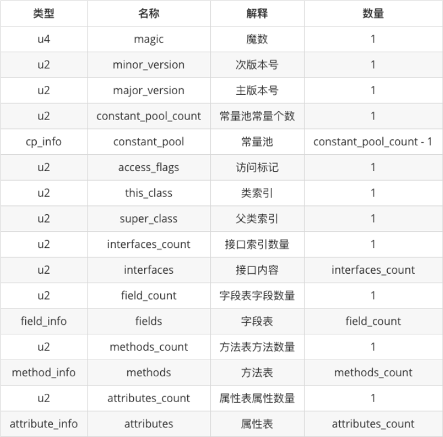

  

**格外注意**  
**1. 常量池是整个class文件的核心，常量池存储了类大部分的数据**  
**2. class文件，由类加载器 加载入JVM内存中后，class文件中的常量池，会解析为方法区中的运行时常量池**

***
* **魔数**(4个字节)   
  class文件的魔数固定为 OxCAFEBABE，如果不是OxCAFEBABE，那么JVM会拒绝执行文件    
  

* **次版本号**(2个字节)
  jdk的次版本号
  

* **主版本号**(2个字节)  
  jdk的主版本号 
  

* **常量池常量个数**(2个字节)   
  

* **常量池**
  有constant_pool_count-1个cp_info结构   
  每个cp_info结构都代表一个常量    
  详细见**2.cp_info.md**
  

* **访问标志**(2个字节)  
  用于识别类或接口的访问信息——是类还是接口，是否为public，是否为abstract等
  

* **类索引**(2个字节)    
  用于指定该类的全限定名
  实际是一个常量，假设这个常量为n，那么类索引指向的就是常量池中索引为n的常量   
  

* **父类索引**(2个字节)  
  用于指定父类的全限定名  
  实际是一个常量，假设这个常量为n，那么父类索引指向的就是常量池中索引为n的常量
  

* **字段表字段数量**(2个字节)  
  包括类的静态变量，实例变量，不包含局部变量  
  

* **字段表**   
  包括类的静态变量，实例变量，不包含局部变量  
  有field_count个field_info结构   
  详细见**3.fieldinfo.md** 
  

* **方法表方法数量**   
  

* **方法表**  
  methods_count个method_info结构      
  详细见**4.methodinfo.md**   
  

* **属性表属性数量**  
  

* **属性表**    
  attributes_count个attribute_info结构    
  详细看**5.attribute.md**
  