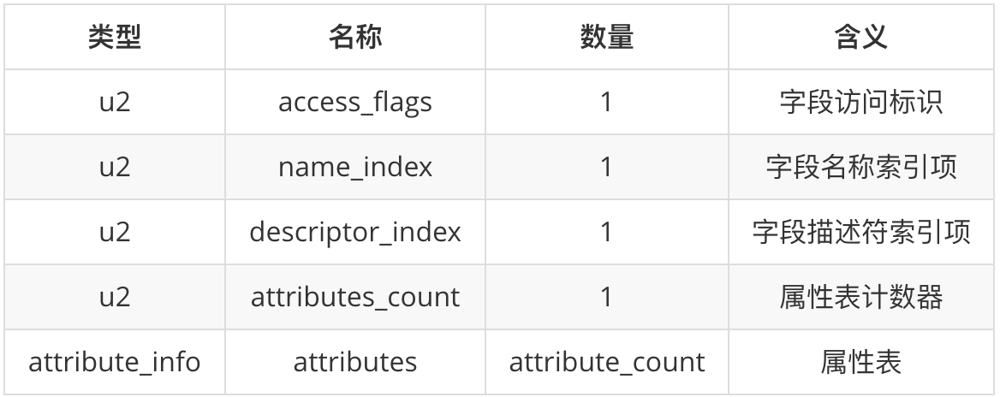
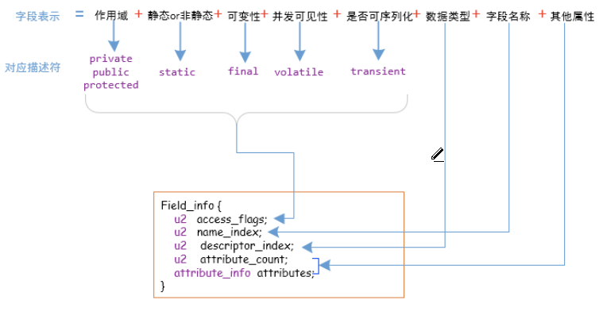
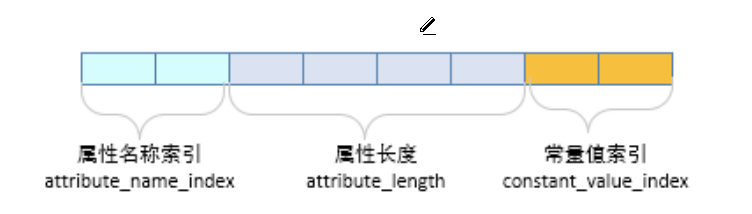

**下图为field_info结构**   

     

* **access_flag**(2个字节)   
  该字段的标识(访问权限，是否为static，是否为final等)
  
* **name_index**(2个字节)  
  用于指示字段的名称   
  实际上是一个常量，我们假设这个常量为n，那么字段的名称就是常量池中索引为n的常量   
  
* **descriptor_index**(2个字节)  
  用于指示字段的描述符(例如类型)   
  实际上是一个常量，我们假设这个常量为n，那么字段的描述符就是常量池中索引为n 的常量   
  
* **attributes_count**(2个字节)   
  属性计数器    
  
* **属性表**  
  attributes_count个attribute_info      
  

* **field_info中的attribute_info结构**   
  
  **field_info中的attribute_info不同于其他的attribute_info**    
  其attribute_info结构如下     
     
  * **属性名称索引**   
    指明该属性的名称    
    本质是一个常数，假设这个常数为n，那么该属性的名称就是常量池中索引为n的常量，该常量固定，为字符串"ConstantValue"   
  * **属性长度**(固定为2)   
  * **常量值索引**   
    指明要讲哪个常量的值赋给该字段   
    本质是一个常数，假设这个常数为n，那么要将常量池中索引为n的常量的值赋给该字段
  