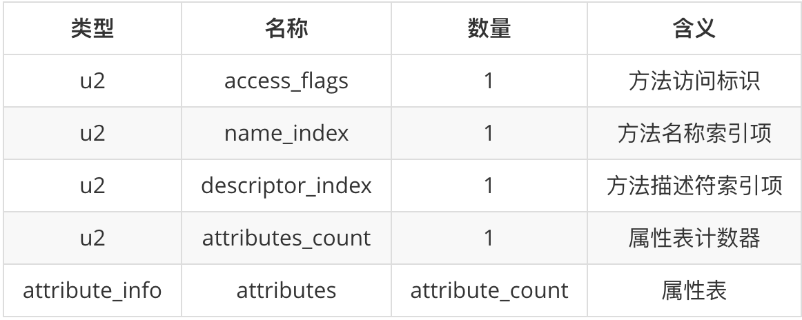
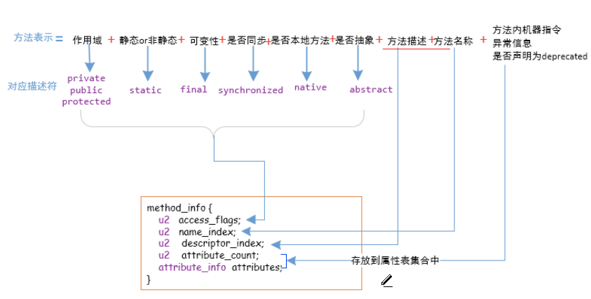

**以下为method_info结构**  

    

* **access_flag**(2个字节)   
  该方法的标识(访问权限，是否为static，是否为final等)

* **name_index**(2个字节)  
  用于指示方法的名称   
  实际上是一个常量，我们假设这个常量为n，那么字段的名称就是常量池中索引为n的常量

* **descriptor_index**(2个字节)  
  用于指示方法的描述符(例如类型)   
  实际上是一个常量，我们假设这个常量为n，那么方法的描述符就是常量池中索引为n 的常量

* **attributes_count**(2个字节)   
  属性计数器

* **属性表**(存储方法的字节码指令，异常信息等)    
  attributes_count个attribute_info     
  **每个方法都有一个属性表，并且必有一个Code属性用来存储方法的字节码指令**  
  

* **attribute_info**   
     
  * **属性名称索引**   
  指明属性的名称，表明该attribute_info存储的是什么信息   
  * **属性长度**  
    表明后面还有多少个字节
  * **属性值**   
  attribute_length个字节  
