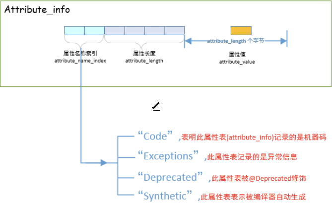
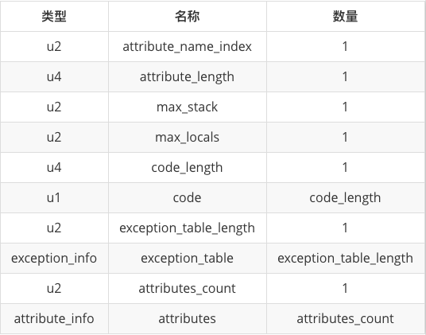

**class文件，field_info，method_info**都有自己的属性表   
每个属性表都有若干个**attribute_info**组成,field_info的attribute_info结构与其他不同
***
Java虚拟机规范定义了23种属性     
* **attribute_info**   
  
  * **属性名称索引**   
    指明属性的名称，表明该attribute_info存储的是什么信息
  * **属性长度**   
    表明后面还有多少个字节
  * **属性值**   
    attribute_length个字节
***
其中Code属性，存储了方法执行的字节码指令   
也就是说，每个方法的属性表中都会有一个Code属性，Code属性存储着**该方法执行的字节码指令**  

**Code属性的格式如下(跟attribute_info格式相同，不过对属性值进行了具体规定)** 
     
* **属性名索引**(2个字节)   
  指明属性的名字   
  实质上是一个常数，假设常数为n，那么属性的名字就是常量池中的第n个常量  
  
* **属性长度**(4个字节)    
  表明Code属性后面还有多少个字节
* **操作数栈的最大大小**(2个字节)   
* **局部变量表的最大大小**(2个字节)    
* **代码长度**(4个字节)   
  表明该Code属性中有多少条字节码指令 
  
* **字节码指令**  
  code_length条字节码，每条占1个字节   
  
* **异常长度**(2个字节)   
* **异常表**   
  指明该方法可能抛出的异常   
  exception_table_length个exception_info   
  
* **属性个数**(2个字节)  
* **属性表**   