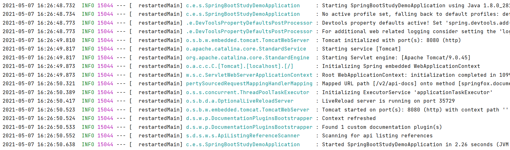

**1. 默认的日志格式**   

SpringBoot默认日志输出到控制台上,每一行都是一条日志   
日志的格式为  
* 日期时间——精确到毫秒  
* 日志级别  
* 进程ID  
* 分隔符  
* 线程名  
* 类名——日志打印所属的类的名字  
* 日志内容——开发人员定义  
  

  
***
* **2. 日志级别**  
SpringBoot的日志级别(SpringBoot默认为INFO)
TRANCE < DRBUG < INFO < WARN < ERROR <FATAL < OFF   
如果设置为WARN,则低于WARN级别的不会输出。

* **3. 修改日志级别**    
在application.yml中添加：  
```
#root 日志级别以WARN级别输出
logging:
  level:
    root: warn
root可以改为包名或类名，用来指定包或类的日志级别  
``` 
***  
**4. 输出日志**   
* 非注解   
①获取Logger对象(org.slf4j包下)   
②调用trace()——输出trace级别的日志  
    调用debug()——输出debug级别的日志  
  ........................
```
    void testLogging(){
        Logger logger=LoggerFactory.getLogger(this.getClass());
        logger.trace("trace log");
        logger.debug("debug log");
        logger.info("info log");
        logger.warn("warn log");
        logger.error("error log");
    }
``` 
* 注解——lombok中的@Slf4j    
使用@Slf4j标注类——类中可以直接使用Logger对象log输出日志   
```
@Slf4j
@SpringBootTest
class SpringBootStudyDemoApplicationTests {
    @Test
    void testLogging2(){
        log.info("这里是info");
        log.info("这里出现了bug");
    }
}
```


***

**5. 输出日志到文件中**   

默认情况下，SpringBoot将日志输出到控制台，不会写到日志文件中，     
如果要编写除控制台之外的日志文件，则需要在application.properties中设置logging.file.name或logging.file.path属性   

**①logging.file.name**   
在整个项目的根目录下创建文件log.log用来存储日志
```
logging:
  file:
    name: log.log
```  


**②logging.file.path**     

在整个项目的根目录下创建文件夹logging，里面会自动创建spring.log用来存储日志  
```
logging:
  file:
    path: logging
```
③二者不能同时使用，如果同时使用，则只有logging.file生效。

④默认情况下，日志文件大小达到10MB会切分一次，产生新的日志文件    

***  
**6. 自定义日志配置**   

application.yml中添加
```
//指定logback配置文件的位置,位于resources根目录下  
logging:
  config: classpath:logback.xml
```  
下面为一个logback配置文件的样式  

```
<?xml version="1.0" encoding="UTF-8"?>
<!-- logback 配置 -->
<configuration>
	<!-- 日志输出到控制台的格式 -->
	<appender name="STDOUT"
		class="ch.qos.logback.core.ConsoleAppender">
		<encoder
			class="ch.qos.logback.classic.encoder.PatternLayoutEncoder">
			<!--格式化输出:%d表示日期;%thread表示线程名;%-5level:左对齐并固定显示5个字符;%msg:日志消息;%n:换行符; -->
			<pattern>%d{yyyy-MM-dd HH:mm:ss.SSS} [%thread] %-5level %logger{50} -
				%msg%n</pattern>
		</encoder>
	</appender>
	<!-- 日志输出到文件的格式 -->
	<appender name="FILE"
		class="ch.qos.logback.core.rolling.RollingFileAppender">
		<!-- 存储日志的文件的位置 -->
		<File>C:/logs/spring-boot-log.log</File>
		<encoder>
			<!--格式化输出:%d表示日期;%thread表示线程名;%-5level:左对齐并固定显示5个字符;%msg:日志消息;%n:换行符; -->
			<pattern>%d{yyyy-MM-dd HH:mm:ss.SSS} [%thread] %-5level %logger{50} -
				%msg%n
			</pattern>
		</encoder>
		<!-- 日志文件的滚动策略 -->
		<rollingPolicy
			class="ch.qos.logback.core.rolling.TimeBasedRollingPolicy">
			<!-- 日志归档 -->
			<fileNamePattern>C:/logs/spring-boot-log-%d{yyyy-MM-dd}.log
			</fileNamePattern>
			<!-- 保留30天日志 -->
			<maxHistory>30</maxHistory>
		</rollingPolicy>
	</appender>
	<!-- 指定日志输出的级别 -->
	<root level="INFO">
		<appender-ref ref="STDOUT" />
		<appender-ref ref="FILE" />
	</root>
</configuration>
```
