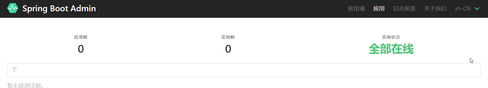

**构建监控服务器**
1. 导入依赖
```
<dependency>
    <groupId>de.codecentric</groupId>
    <artifactId>spring-boot-admin-starter-server</artifactId>
    <version>2.4.1</version>
</dependency>
```  
2. 启动类加上 **@EnableAdminServer**  
3. 访问 **http://127.0.0.1:8080**  
      
   

***
**构建监控客户端——另一个SpringBoot项目**   
1. 导入依赖  
```
<dependency>
    <groupId>de.codecentric</groupId>
    <artifactId>spring-boot-admin-starter-client</artifactId>
    <version>2.4.1</version>
</dependency>
```

2. 匹配文件
```
server.port=8091   //客户端的端口号
spring.boot.admin.client.url=http://127.0.0.1:8080  //客户端要连接的服务器的URL
spring.boot.admin.client.instance.name=CLIENT1  //客户端的名字  
```

3. Client默认只会让服务器显示少量信息，如果Client想让服务器可以知道自己的大量信息，配置文件加入  
```
management.endpoints.web.exposure.include=*
//*表示全部信息 
```
***
**自动报警**  
1. 服务器添加依赖  
```
<dependency>
    <groupId>org.springframework.boot</groupId>
    <artifactId>spring-boot-starter-mail</artifactId>
</dependency>
``` 

2. 配置文件配置