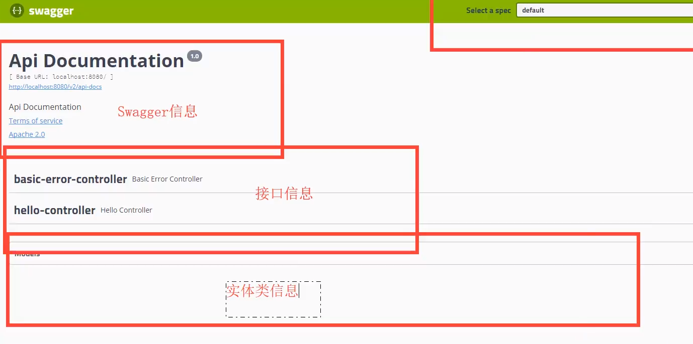

 
***
1. 引入依赖
```
<!-- 添加swagger2相关功能 -->
   	<dependency>
   		<groupId>io.springfox</groupId>
   		<artifactId>springfox-swagger2</artifactId>
   		<version>2.9.2</version>
   	</dependency>
   	<!-- 添加swagger-ui相关功能 -->
   	<dependency>
   		<groupId>io.springfox</groupId>
   		<artifactId>springfox-swagger-ui</artifactId>
   		<version>2.9.2</version>
   	</dependency>
```  
***
2. 启用并配置 Swagger2 功能  
   @Configuration——配置类   
   @EnableSwagger2——启动Swagger2功能
   @Bean——将Docket对象放入Spring容器    
```java
@Configuration//配置类
@EnableSwagger2//启动Swagger2功能
public class SwaggerConfiguration {
    @Bean//自定义的Docket对象要放入Spring容器
    public Docket getDocket(){
        //创建一个SwaggerAPI文档对象Docket，内置默认api信息
        Docket docket= new Docket(DocumentationType.SWAGGER_2);
        
        //创建api对象，自定义设置api信息
        ApiInfo apiInfo=getApiInfo();
        docket.apiInfo(apiInfo);
        
        //SwaggerAPI文档显示该包下的所有内容
       //select()出现必须有build(),select()和build()之间可以加apis()或paths()
        docket.select().apis(RequestHandlerSelectors.basePackage("com")).paths(PathSelectors.any()).build();
        return docket;
    }
    
    public ApiInfo getApiInfo(){
        //Contact对象存储作者信息——名字，网站，电子邮箱
        Contact contact=new Contact("黄相淇","url.com","907478820@qq.com");
        ApiInfo apiInfo = new ApiInfo(
                "黄相淇的SwaggerAPI文档",//api标题
                "欢迎来到黄相淇的SwaggerAPI文档",//api描述
                "1.0", //api版本号
                "team.url",//组织的URL
                contact,//Concat对象
                "Apache 2.0",//文档名称
                "http://www.apache.org/licenses/LICENSE-2.0",//文档链接
                new ArrayList<>());
        return apiInfo;
    }
}
``` 
***
3. 启动项目，然后访问 http://127.0.0.1:8080/swagger-ui.html ，即可打开自动生成的可视化测试页面，页面会显示Control和Model的信息   
   

***

4. 生成API文档——直接在Controller上加注解即可  
   @Api(tags = "商品API")  注解Controller
   @ApiOperation(value = "根据id获取商品信息") 注解服务方法 // 接口文档显示内容
  


