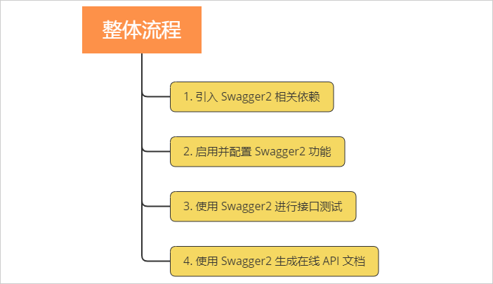

 
1. 引入依赖
```
<!-- 添加swagger2相关功能 -->
   	<dependency>
   		<groupId>io.springfox</groupId>
   		<artifactId>springfox-swagger2</artifactId>
   		<version>2.9.2</version>
   	</dependency>
   	<!-- 添加swagger-ui相关功能 -->
   	<dependency>
   		<groupId>io.springfox</groupId>
   		<artifactId>springfox-swagger-ui</artifactId>
   		<version>2.9.2</version>
   	</dependency>
```  

2. 启用并配置 Swagger2 功能  
   添加一个**配置类**，专门用于配置 Swagger2 相关功能，这样比较清晰点。通过 **@EnableSwagger2 开启Swagger2 功能**  
   通过 **@Bean 标注的方法**将对 Swagger2 功能的设置放入容器
```
@Configuration // 告诉Spring容器，这个类是一个配置类
@EnableSwagger2 // 启用Swagger2功能
public class Swagger2Config {
	/**
	 * 配置Swagger2相关的bean
	 */
	@Bean
	public Docket createRestApi() {
		return new Docket(DocumentationType.SWAGGER_2)
				.apiInfo(apiInfo())
				.select()
				.apis(RequestHandlerSelectors.basePackage("com"))// com包下所有API都交给Swagger2管理
				.paths(PathSelectors.any()).build();
	}
	/**
	 * 此处主要是API文档页面显示信息,可以根据需要修改
	 */
	private ApiInfo apiInfo() {
		return new ApiInfoBuilder()
				.title("演示项目API") // 标题
				.description("学习Swagger2的演示项目") // 描述
				.termsOfServiceUrl("http://www.imooc.com") // 服务网址，一般写公司地址
				.version("1.0") // 版本
				.build();
	}
}
``` 
3. 启动项目，然后访问 http://127.0.0.1:8080/swagger-ui.html ，即可打开自动生成的可视化测试页面  
页面中会显示所有的Controller的信息  
   
4. 生成API文档——直接在Controller上加注解即可  
   @Api(tags = "商品API")  注解Controller
   @ApiOperation(value = "根据id获取商品信息") 注解服务方法 // 接口文档显示内容
