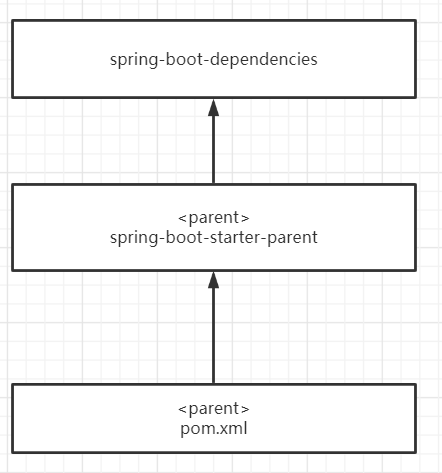
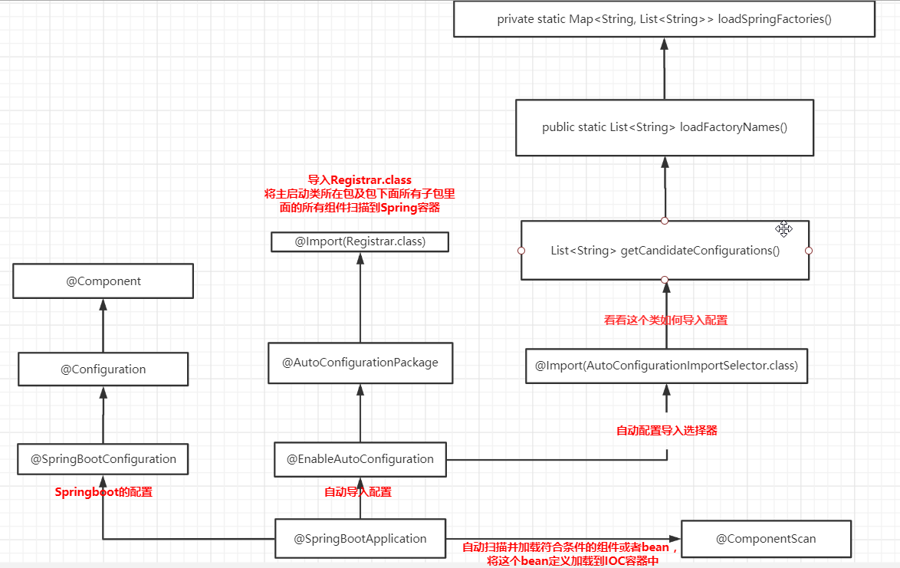
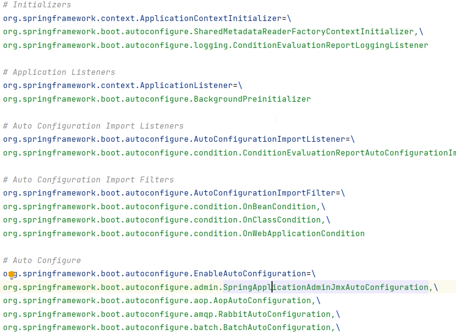
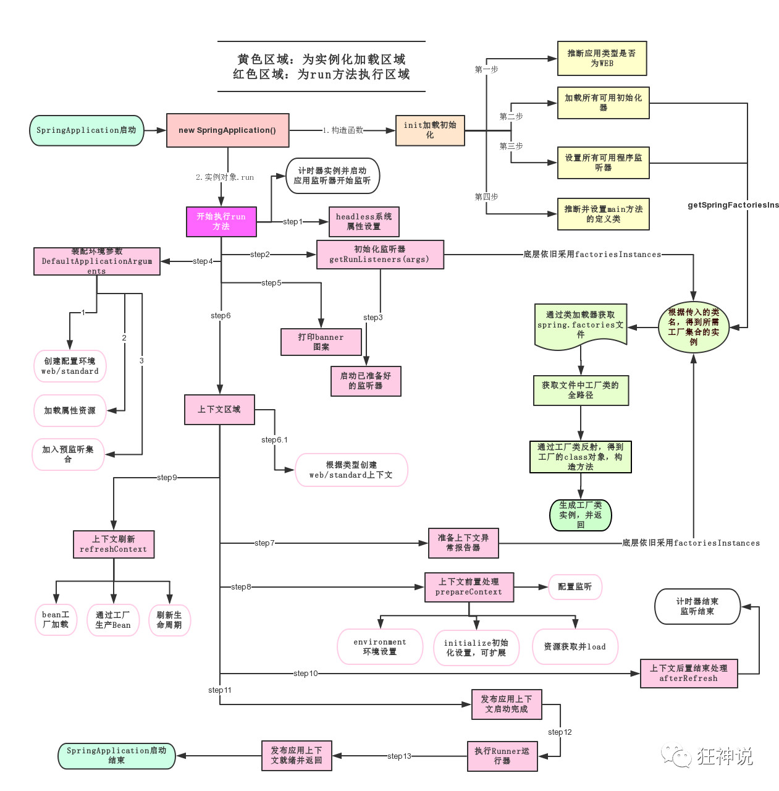

**1. pom.xml**   
   
       spring-boot-dependencies为核心依赖，里面管理了大量的Jar包版本   
       我们在pom.xml中导入依赖时，不需要指定版本，就是因为有这些版本库   
   
***
**2. 启动器**  
```
<dependency>
    <groupId>org.springframework.boot</groupId>
    <artifactId>spring-boot-starter-web</artifactId>
</dependency>
```  
springboot-boot-web-starter会自动帮我们导入web环境所有的依赖
springboot会将所有的功能场景，都变成一个个的启动器   
我们需要什么功能，就导入对应的启动器 

***

  
**3. 主程序**    
```java
@SpringBootApplication
public class SpringBootStudyDemoApplication {
    public static void main(String[] args) {
        SpringApplication.run(SpringBootStudyDemoApplication.class, args);
    }
}
```
* @SpringBottApplication——自动配置
      
  AutoConfigurationImportSelector自动导入组件的方法
  
```
  // 获得候选的配置
protected List<String> getCandidateConfigurations(AnnotationMetadata metadata, AnnotationAttributes attributes) {
    //这里的getSpringFactoriesLoaderFactoryClass（）方法
    //返回的就是我们最开始看的启动自动导入配置文件的注解类；EnableAutoConfiguration
    List<String> configurations = SpringFactoriesLoader.loadFactoryNames(this.getSpringFactoriesLoaderFactoryClass(), this.getBeanClassLoader());
    Assert.notEmpty(configurations, "No auto configuration classes found in META-INF/spring.factories. If you are using a custom packaging, make sure that file is correct.");
    return configurations;
} 
```  
```
public static List<String> loadFactoryNames(Class<?> factoryClass, @Nullable ClassLoader classLoader) {
    String factoryClassName = factoryClass.getName();
    //这里它又调用了 loadSpringFactories 方法
    return (List)loadSpringFactories(classLoader).getOrDefault(factoryClassName, Collections.emptyList());
}
```   
```
private static Map<String, List<String>> loadSpringFactories(@Nullable ClassLoader classLoader) {
    //获得classLoader ， 我们返回可以看到这里得到的就是EnableAutoConfiguration标注的类本身
    MultiValueMap<String, String> result = (MultiValueMap)cache.get(classLoader);
    if (result != null) {
        return result;
    } else {
        try {
            //去获取一个资源 "META-INF/spring.factories"
            Enumeration<URL> urls = classLoader != null ? classLoader.getResources("META-INF/spring.factories") : ClassLoader.getSystemResources("META-INF/spring.factories");
            LinkedMultiValueMap result = new LinkedMultiValueMap();

            //将读取到的资源遍历，封装成为一个Properties
            while(urls.hasMoreElements()) {
                URL url = (URL)urls.nextElement();
                UrlResource resource = new UrlResource(url);
                Properties properties = PropertiesLoaderUtils.loadProperties(resource);
                Iterator var6 = properties.entrySet().iterator();

                while(var6.hasNext()) {
                    Entry<?, ?> entry = (Entry)var6.next();
                    String factoryClassName = ((String)entry.getKey()).trim();
                    String[] var9 = StringUtils.commaDelimitedListToStringArray((String)entry.getValue());
                    int var10 = var9.length;

                    for(int var11 = 0; var11 < var10; ++var11) {
                        String factoryName = var9[var11];
                        result.add(factoryClassName, factoryName.trim());
                    }
                }
            }

            cache.put(classLoader, result);
            return result;
        } catch (IOException var13) {
            throw new IllegalArgumentException("Unable to load factories from location [META-INF/spring.factories]", var13);
        }
    }
}
```   
   **通过上述代码我们可以看到，最后我们要去获取META-INF/spring.factories**,如下图  
      
   spring.factories中的每个类有@Configuration和@Bean——都是配置类      
   所以，自动配置真正实现是从classpath中搜寻所有的META-INF/spring.factories配置文件，将其中所有的配置类,通过反射实例化后加载到Spring容器中    

* SpringApplication.run()
   