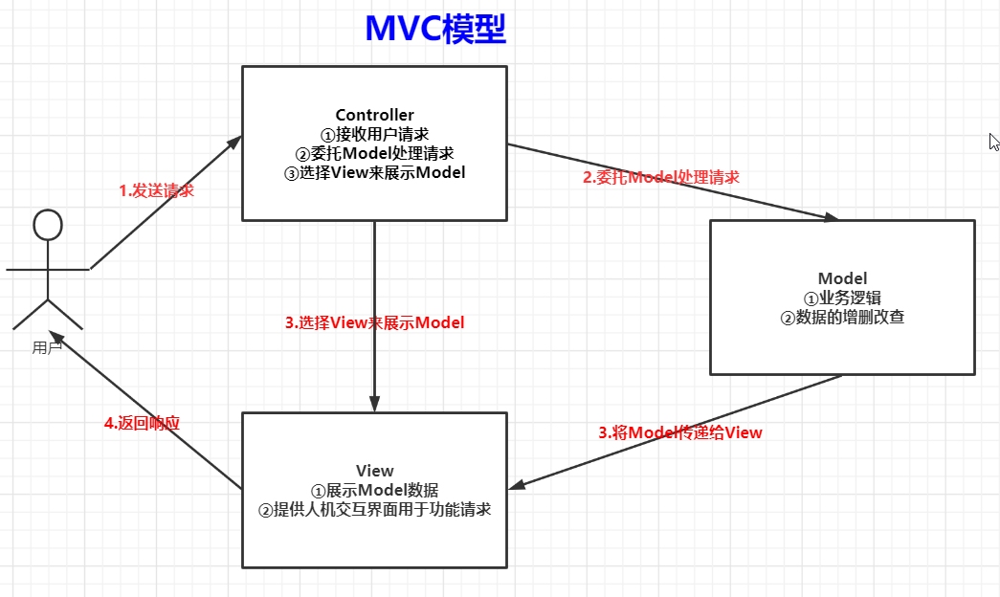
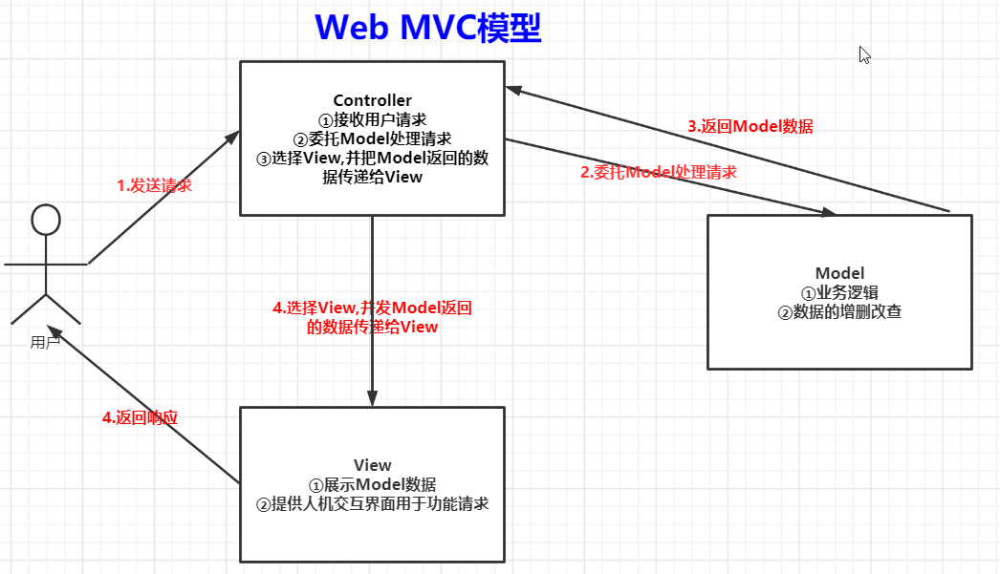

**1. MVC介绍**   
MVC(Model-View-Controller)——不引入新功能,使展示与模型分离,流程控制逻辑,业务逻辑调用与展示逻辑分离
* Model——数据模型,提供要展示的数据
* View——视图,负责进行模型的展示,一般就是用户界面
* Controller——控制器,接受用户请求,委托Model进行处理,处理完毕后将数据传递给View,由View负责展示  
     
   

**2. Web MVC**  
Web MVC下，Model无法推送数据给View
     

**3. SpringMVC**   
SpringMVC在Web MVC基础上又进行了修改   
     