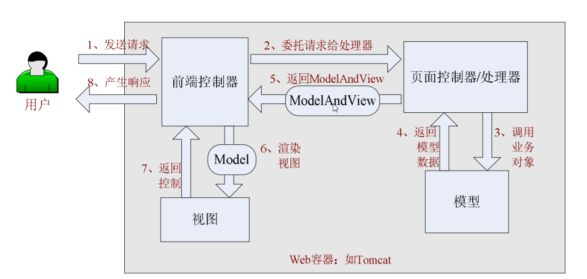
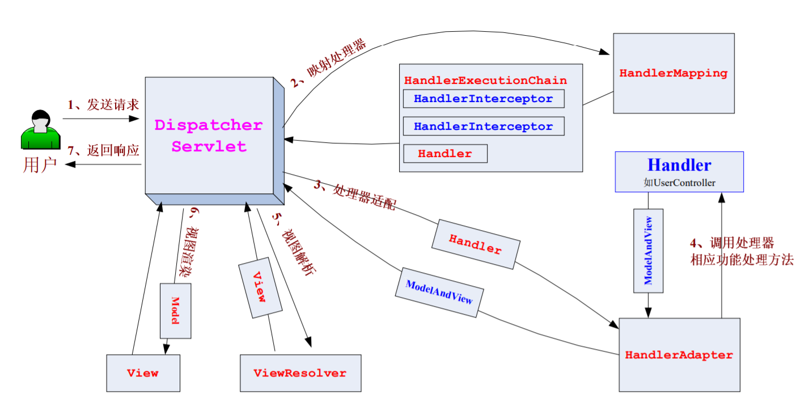

**1. SpringMVC处理请求流程**  
    
* **①.** 用户发送请求——>前端控制器  
* **②.** 前端控制器根据**请求中的请求信息(如URL)** 来决定选择哪一个处理器来处理请求,将请求委托给处理器处理  
* **③.** 处理器接收到请求后,进行功能处理,首先会将请求参数绑定到一个**命令对象**中,并进行参数验证,然后将**命令对象**委托给Model进行处理  
* **④.** Model处理完,返回一个**ModelAndView(模型数据和逻辑视图名)** 给处理器   
* **⑤.** 处理器把ModelAndView传递给前端控制器  
* **⑥.** 前端控制器根据ModelAndView中的逻辑视图名,选择相应的的View,将Model传递给这个View进行渲染视图  
* **⑦.** View完成渲染视图后,返回给前端控制器   
* **⑧.** 前端控制器产生响应   

**2. SpringMVC核心架构——DispatcherServlet**  

**前端控制器——DispatcherServlet**   
**以下的流程代码都在DispatcherServlet中**  
   
**①.** 用户发送请求——>DispatcherServlet  
**②.** DispatcherServlet进行**请求到处理器的映射**,**将请求映射为HandlerExecutionChain对象**(该对象包含一个Handler处理器对象,多个HandlerInterceptor拦截器对象)  
**③.** DispatcherServlet进行**处理器适配**,将Handler对象包装为相应的HandlerAdapter适配器对象   
**④.** 由HandlerAdapter对象调用Handler对象的相应功能的处理方法,得到**ModelAndView(模型数据和逻辑视图名)对象**    
**⑤.** **视图解析**，从ModelAndView中可以得到**视图名**，ViewResolver会把视图名解析成具体的View对象  
**⑥.** **视图渲染**，把Model传递给View进行视图渲染  
**⑦.** 返回控制权给DispatcherServlet  
**⑧.** 响应用户  
