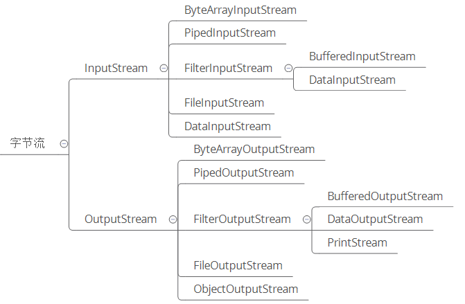
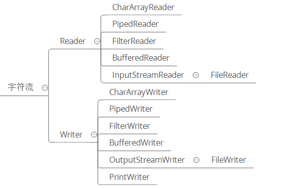
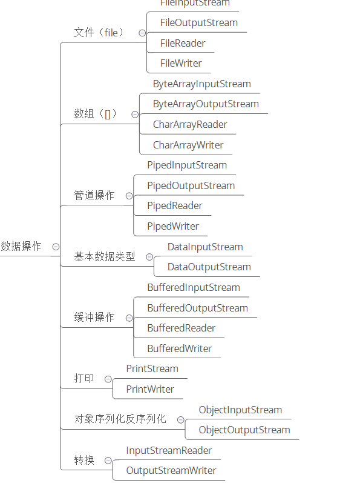

**流的概述**   

Java程序中,对于数据的输入/输出操作 都已 **"流"** 的方式进行
Java的IO流都是站在程序的角度  
输入程序——Input   
从程序输出——Output
***
**流的分类**
1. 按照**操作数据单元**——字节流 ; 字符流
2. 按照数据流的方向——输入流 ; 输出流
3. 按照流的角色——节点流 ; 处理流
***
**四大基类**    

**InputStream** —— 字节输入流   
**OutputStream**  —— 字节输出流   
**Reader** —— 字符输入流   
**Writer** —— 字符输出流     

***
**IO流体系结构**   
1. **按照继承关系划分**

    
   
2. **按照操作对象划分**   
  