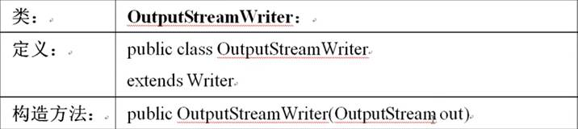
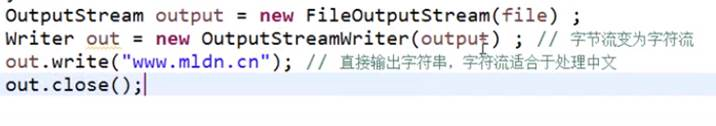

转换流——实现**字节流**和**字符流**的转换   
InputStreamReader,OutputStreamWriter     

**实现字节流与字符流的转换**   
那么这两个类是如何实现字节流和字符流的转换的呢？   
我们来看看这两个类的定义和构造方法（只拿一个举例）  
我们发现OutputStreamWriter是Writer的子类，但是构造方法接受了OutputStream对象    
所以OutputStreamWriter   
①通过构造方法，接收一个字节流对象OutputStream来创建OutputStreamWriter实例   
②通过向上转向，转换为字符流对象Writer 例子如下

