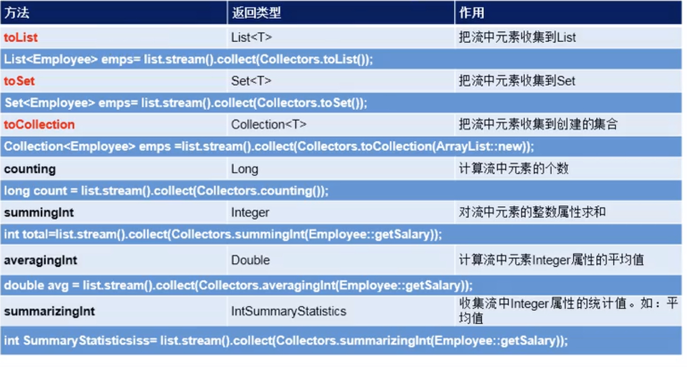

**什么是Stream**  
* 之前我们学习了集合,集合是用来存储数据的,但无法对数据进行处理   
  那么Stream就是用来对 流中的数据进行处理
* Stream的特征
   * Stream自己不会存储元素,关注的是对数据的运算   
   * Stream的中间操作都不会改变源对象，都只会返回一个持有结果的Stream
   * Stream不调用终止操作,那么中间操作都不会执行   
     Stream一旦调用终止操作,中间操作会一次性执行完毕,然后关闭Stream,也就是说Stream调用终止操作后,就不能执行其他操作了   
    
* Stream操作的步骤
   * ①创建Stream  
    * ②定义中间操作链(过滤，映射等)，用于对Stream中的数据进行处理(暂时不会执行)   
    * ③终止操作 : 一旦执行了终止操作,就会执行中间操作链,并产生结果   
    
```
stream.filter(x->x>500).limit(20).distinct().skip(10).forEach();

filter,limit,distinct,skip这些都是中间操作,每个操作都会返回一个持有结果的Stream
forEach是终止操作,如果没有forEach,那么这些中间操作不会执行
```
***
**创建Stream**  
* 通过集合创建Stream
   * Collection提供——Stream <E> stream():返回一个顺序流,从顺序流取数据是按照集合中的顺序来  
   * Collection提供Stream <E> parallelStream():返回一个并行流  
  

* 通过数据创建Stream  
  Arrays提供了 Arrays.stream(T[] arr)   
  传入一个数组,可以返回一个数组转换成的Stream  
  

* Stream提供的 Stream.of(val1,val2......)   
  将传入的这些值转换为一个Stream
  

* Stream的顺序流和并行流  
  * Stream提供有stream.sequential()可以切换为顺序流,还提供有stream.parallel()可以切换为并行流  
  * 顺序流——Stream中的数据由一个线程逐个处理  
  * 并行流——Stream中欧给的数据分为多个数据块,每个数据块由不同的线程处理  
***
**中间操作**  
多个中间操作形成一个中间操作链，除非触发终止操作，否则中间操作不会执行任何处理   
一旦触发终止操作,多个中间操作会一次性处理   
注意,每个中间操作,都会返回一个持有结果的Stream

1. **筛选和切片**  
* filter(Predicate p)接受lambda,从流中筛选出符合lambda表达式的元素   
```
stream.filter(x->x>300).forEach(s->System.out.println(s));
筛选出流中>300的元素,然后遍历输出
```
* distinct() 根据流中元素的hashCode()和equals()去除重复元素
* limit(long maxSize) 截断流,返回一个只含有前maxSize个元素的Stream
```
stream.filter(x->x>300).limit(10).forEach(s->System.out.println(s));
筛选出流中>300的元素,留下前10个元素,遍历输出
```
* skip(long n) 跳过前n个元素，返回一个扔掉了前n个元素的Stream，若Stream中元素不足n个，则返回一个空流
2. **映射操作**  
*  map(Function f)—— 接受一个 Function函数接口f作为参数, 创建一个新Stream, Stream中的每个元素都会调用 f 的apply(),并将返回值放入该新Stream中, 最后返回该新Stream
```
stream.map(x-> {return x*2;}).forEach(s->System.out.println(s)); 
Stream中的每个元素*2后放入新Stream中,然后遍历新Stream  
```  

* flatMap(Function f)——大多数情况下，效果如map
  区别在于——假设stream1={ val1,val2,.....,stream2},stream2={v1,v2,v3....}
  那么对于map, 会把stream2当作一个元素,调用f.apply(stream2)  
  那么对于flatmap,会把stream2中的每个元素逐个取出来,逐个调用f.apply(vi);
  
* mapToDouble(ToDoubleFucntion f)接受一个函数f作为参数,该函数运用到Streamd的每个元素上，产生一个新的DoubleStrean  
* mapToInt(ToIntFunction f)
* mapToLong(ToLongFunction f)   

3. **排序**  
* sorted(): 对Stream中的元素进行排序,返回一个新Strean(要求,Stream中的元素实现了Comparable接口)
* sorted(Comparator com):根据com,对Stream中的元素进行排序,返回一个新Strean  

***
**终止操作**   
1. **匹配与查找** 
* boolean allMathc(Predicate p): Stream中的所有元素是否都满足lambda表达式
* boolean anyMatch(Predicate p): Stream中是否至少有一个元素满足lambda表达式
* boolean noneMatch(Predicate p): Stream的所有元素是否都不满足lambda表达式
* findFirst(): 返回Stream中的第一个元素
* findAny(): 随机返回Stream中的一个元素
* count(): 返回Stream中的元素个数
* max(Comparator c): 返回Stream中的最大元素 
* min(Comparator c): 返回Stream中的最小元素
* void forEach(Consumer<? super T> action);——对Stream中的每个元素都调用一个action的accept();  

2. **规约**   
* T reduce(T identity, BinaryOperator<T> accumulator);——Stream的元素和indetity按照BinaryOperator合并为一个T类型元素  
* Optional<T> reduce(BinaryOperator<T> accumulator); ——Stream中的元素按照BinaryOperator并为一个元素,将该元素转放入Optinal容器返回     

3. **收集**  
* <R, A> R collect(Collector<? super T, A, R> collector);——接受一个Colletor接口,将Stream中的元素做汇总    
  Collections类提供了许多静态方法,如下图  
  