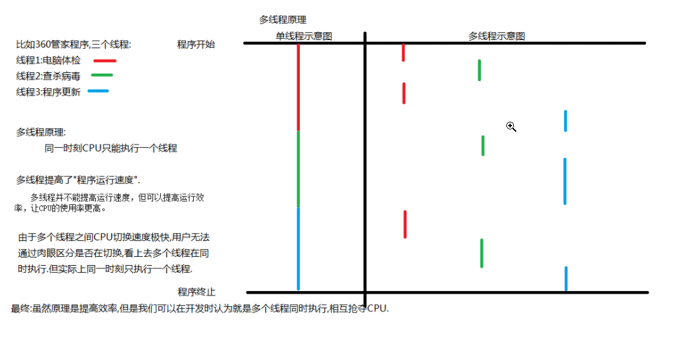

[toc]

### 1. 进程与线程

#### 1.1 进程

* **概念**

  程序的一次执行过程，系统分配和管理资源的基本单位

* **特点**

  * 每个进程都有自己独立的内存空间
  * 一个进程中有个线程，线程并发

#### 1.2 线程

* **概念**

  线程是任务调度和执行的基本单位

* **特点**

  * 所有线程共享进程的内存空间（JVM的线程共享区域）
  * 每个线程都有自己的独立内存空间（JVM的线程私有区域）
  * 线程之间并发执行

#### 1.3 进程和线程的区别

* 每个进程有自己的独立内存空间——进程切换开销大

  每个线程也有自己的独立内存空间——线程切换开销小

* 一个进程崩溃后，在保护模式下不会对其他进程产生影响

  但一个线程崩溃后，可能会影响整个程序的稳定性

  进程比线程健壮
  
* 进程创建和销毁的开销大

  线程创建和销毁的开销小

#### 1.4 多线程原理

#### 1.5 为什么要有多线程

* **使用更多的处理器核心**

  一个线程在一个时刻只能运行在一个处理器核心上

  如果有多个CPU，单线程程序无法使用更多的处理器核心

* **更快的响应时间**

* **更好的编程模型**

### 2. 并行与并发

#### 2.1 并行(parallel)

同一时刻，有多个任务在多个处理器上同时执行

#### 2.2 并发(concurrent)

一个处理器上，同一时刻只有一个任务执行，但多个任务被快速地轮换执行，宏观上具有多个任务同时执行的效果，但微观上不是同时执行

### 3. 同步与异步

同步与异步是对应于调用者与被调用者，它们是线程之间的关系，两个线程之间要么是同步的，要么是异步的

* 应用进程——调用者 ; 内核——被调用者   

* 同步: 调用者需要等待被调用者返回结果，才会进行下一步操作   
  (需要等待内核完成①后才能进行②)  
* 异步: 调用者不需要等待被调用者返回调用，即可进行下一步操作，被调用者通常依靠事件、回调等机制来通知调用者结果  
  (应用进程不等继续做自己的事情,将①②都交给内核完成,内核完成后通知应用进程即可)

### 4. 阻塞与非阻塞

阻塞与非阻塞是对同一个线程来说的，在某个时刻，线程要么处于阻塞，要么处于非阻塞   

* 阻塞:**调用者** 调用 **被调用者**后, 调用者挂起,等待被调用者返回结果  
* 非阻塞：**调用者** 调用 **被调用者**后,调用者不受影响,继续做自己的事情   

