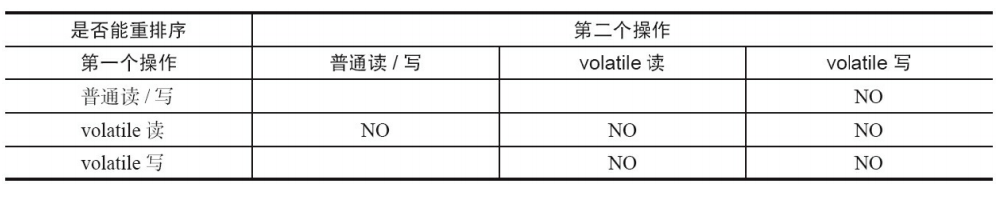
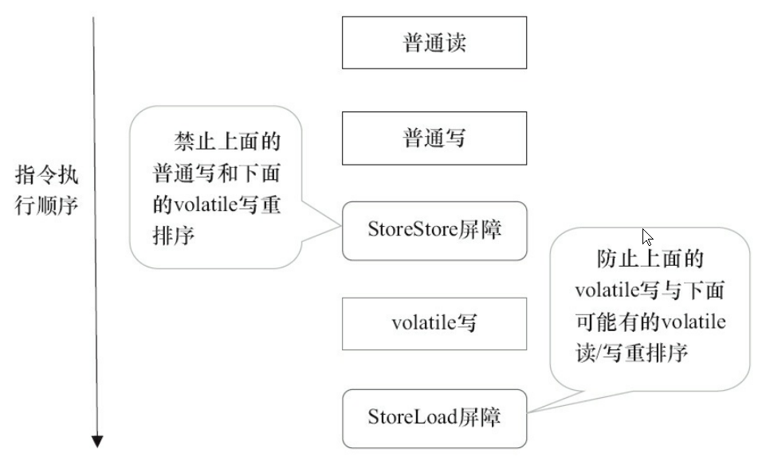
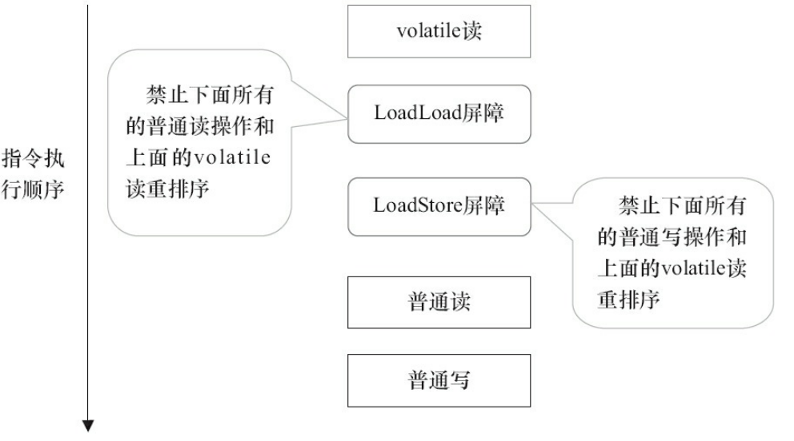

### 1. volatile作用

#### 1.1 保证变量的可见性

volatile变量的修改对所有线程可见，体现在读，写两方面

* **写**

  某个线程在自己的本地内存中修改volatile变量，会立刻刷新到主内存中

* **读**

  某个线程如果想要读取volatile变量，JMM将该线程对应的本地内存设置为无效，该线程只能从主内存中获取

#### 1.2 保证变量的单次读写具有原子性

对volatile变量的单次读写操作具有**原子性**(JMM不保证64位数据double或long的读写操作具有原子性)，对于 **i++这种复合操作**，仍然是没有原子性的

**volatile只保证变量的单次读写具有原子性，复合操作就没有原子性了**

#### 1.3 禁止指令重排序，保证有序性

- 当程序执行到volatile变量的读操作或者写操作时，在其前面的操作的更改肯定全部已经进行，且结果已经对后面的操作可见，在其后面的操作肯定还没有进行。
- 在进行指令优化时，不能将在对volatile变量访问的语句放在其后面执行，也不能把volatile变量后面的语句放到其前面执行。

### 2. volatile内存语义

* 线程写一个volatile变量时，JVM会把线程对应的本地内存中的共享变量的值刷新到主内存中
* 当线程读一个volatile变量时，JMM会把该线程对应的本地内存置为无效。线程接下来将从主 内存中读取共享变量

### 3. volatile内存语义的实现

#### 3.1 volatile指令重排序表

**volatile会禁止指令重排序**，为了实现volatile的内存语义，编译器在生成字节码时，会在指令序列中插入 **内存屏障**来禁止指令重排序

#### 3.2 基于保守策略的JMM内存屏障插入策略

1. 在每个volatile写操作的前面插入一个StoreStore屏障。 

   在每个volatile写操作的后面插入一个StoreLoad屏障。 

   

   * StoreStore屏障保证在volatile写之前，前面的所有普通写操作都已经同步到主内存了

2. 在每个volatile读操作的后面插入一个LoadLoad屏障和一个LoadStore屏障

   

