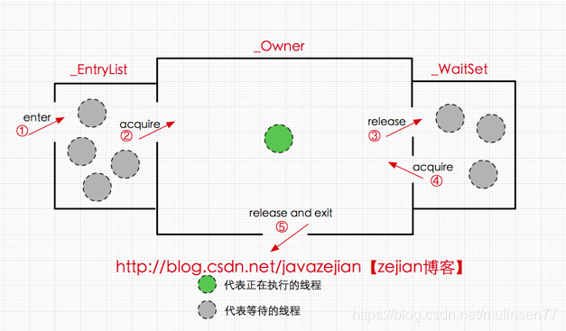
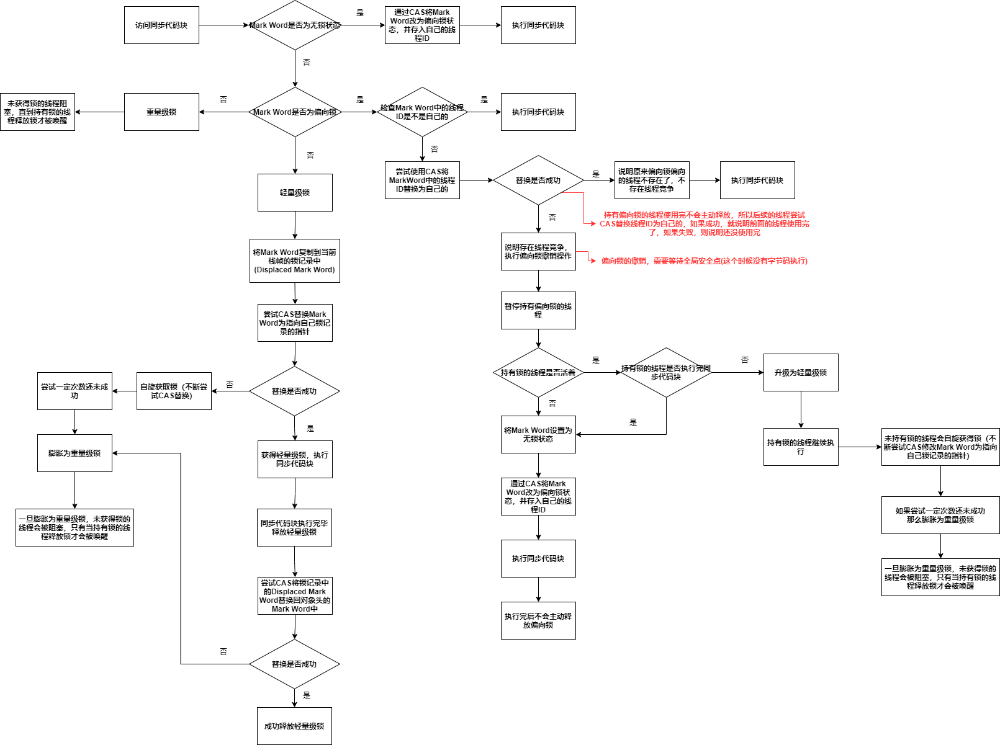

[toc]

### 1. synchronized实现前提


#### 1.1 对象监视器monitor

任何一个对象都有一个monitor对象与之关联

**monitor提供线程阻塞和唤醒机制**

当一个monitor被某个线程持有，它将处于锁定状态（获取锁）

```C++
ObjectMonitor() {
    _header       = NULL;
    _count        = 0;  //锁计数器,sychronized是可重入锁
    _waiters      = 0,  
    _recursions   = 0;
    _object       = NULL;
    _owner        = NULL; //标识持有锁的线程
    _WaitSet      = NULL; //等待队列，与Object的wait()和notify()有关
    _WaitSetLock  = 0 ;
    _Responsible  = NULL ;
    _succ         = NULL ;
    _cxq          = NULL ;
    FreeNext      = NULL ;
    _EntryList    = NULL ; //同步队列，尝试获取锁的线程会进入EntryList，如果成功获得锁，则设置monitor的_owner为，如果没有成功获得锁，在EntryList中阻塞等待
    _SpinFreq     = 0 ;
    _SpinClock    = 0 ;
    OwnerIsThread = 0 ;
  }
```



**核心字段**

* **_count**：计数器，如果为0，表示没有线程获得锁，如果不为0，表示有线程取得锁（可以实现可重入锁，持有锁的线程每尝试再次获取锁，计数器都会+1）
* **_owner**：标识持有锁的线程
* **_EntryList**：一个线程如何尝试获取锁，会进入_EntryList，如果获得锁成功，将 _owner修改为自己；如果获得锁失败，则会在同步队列EntryList中阻塞等待
* **_waitSet**：等待队列，与Object的wait()和notify()有关，如果一个线程在持有锁时，调用了其wait()，那么该线程会进入其_waitSet中，阻塞，并释放锁，知道有其他线程在持有锁时，调用其notify()将线程唤醒


#### 1.2 JVM提供的指令

synchronized在JVM中通过 **monitorenter指令**和 **monitorexit指令**来进入和退出同步代码块

* **monitorenter指令**

  编译器会将monitorenter插入在同步代码块开始的位置，执行该指令时，会尝试获取通同步对象的monitor对象的所有权（尝试获得锁）

* **monitorexit指令**

  编译器会将monitorexit插入在同步代码块的结束处或异常处，释放同步对象的monitor对象的所有权（释放锁）


#### 1.3 Mark Word

对象由三个部分组成——对象头，实例数据，对齐填充

对象头结构如下（非数组2个字，数组3个字）

* 第一个字——**Mark Word**
* 第二个字——指向对象Class对象的指针
* 第三个字——数组长度

sychronized的实现与 **Mark Word**有关


#### 1.4 栈帧中的锁记录

线程的栈帧中有一块空间——**锁记录**

* 线程如果成果获取偏向锁，会在锁记录中存储偏向锁偏向的线程ID
* 在尝试获取轻量级锁前，会把对象头的Mark Word复制到自己的锁记录中

### 2. 锁升级

JDK1.6前，sychronzied是重量级锁

JDK1.6做了优化，对锁进行了分类——无锁，偏向锁，轻量级锁，重量级锁

#### 2.1 锁升级过程




* **偏向锁**

  持有偏向锁的线程使用完不会主动释放锁

  下一个线程尝试获取偏向锁，会尝试通过CAS将Mark Word中的线程ID替换为自己的，如果原来持有锁的线程已经结束了同步代码块，那么替换就会成功，下一个线程就会取得锁

* **轻量级锁**

  持有锁的线程使用完后会尝试释放锁，如果释放失败，则升级为重量级锁

* **重量级锁**

  会阻塞未获取锁的线程，**除了重量级锁，其他情况下，未持有锁的线程不会阻塞**

#### 2.2 各个锁的优缺点

| 锁       | 优点                               | 缺点                                       | 适用场景                               |
| -------- | ---------------------------------- | ------------------------------------------ | -------------------------------------- |
| 偏向锁   | 加锁和解锁不需要额外消耗           | 如果线程间存在锁竞争，撤销锁会带来额外消耗 | 适用于只有一个线程访问同步代码块的情况 |
| 轻量级锁 | 竞争锁的线程不会阻塞，加快响应速度 | 如果使用竞争不到锁，自旋会消耗CPU性能      | 追求响应速度                           |
| 重量级锁 | 竞争锁的线程阻塞，不消耗CPU        | 线程阻塞，响应时间慢                       | 追求吞吐量，同步代码快执行时间较长     |


### 3. sychronized的内存语义

1. 编译器会将**monitorenter指令**插入在同步代码块开始的位置，当线程执行到该指令时，会尝试获取同步对象的monitor的所有权（尝试获取锁），如果获取成功，则成功获得锁——**JMM会将线程对应的本地内存设置为无效，从而使得该线程执行同步代码块时必须从主内存读取共享变量**，如果线程A获取锁，那么其他线程就不能执行同步代码块，只能等待线程A释放锁（保证线程A执行同步代码块的原子性）
2. 编译器会将**monitorexit指令**插入在同步代码块的结束处或异常处，当线程执行到该指令时，会释放同步对象的monitor的所有权(释放锁)，**JMM会把线程本地内存中的副本刷新到主内存中**
3. sychronized会保证同步代码块的有序性——JMM只允许某一个时刻只有一个线程执行同步代码块，JMM不允许同步语句与非同步语句重排序，但是允许同步代码块内在不改变结果的前提下进行重排序（JMM虽然允许同步代码块内重排序，但是在程序员看来仍是有序的）

**sychronized通过上面3点，保证同步代码块具有内存可见性，原子性，有序性**