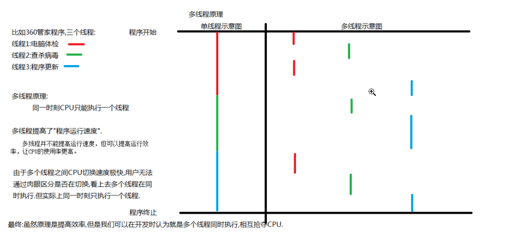

[toc]

### 1. 进程

#### 1.1 概念

#### 程序的一次执行过程，系统分配和管理资源的基本单位

#### 1.2 特点

* 每个进程都有自己独立的内存空间
* 一个进程中有个线程，线程并发

### 2. 线程

#### 2.1 概念

线程是任务调度和执行的基本单位

#### 2.2 特点

* 所有线程共享进程的内存空间（JVM的线程共享区域）
* 每个线程都有自己的独立内存空间（JVM的线程私有区域）
* 线程之间并发执行

### 3. 进程和线程的区别

* 每个进程有自己的独立内存空间——进程切换开销大

  每个线程也有自己的独立内存空间——线程切换开销小

* 一个进程崩溃后，在保护模式下不会对其他进程产生影响

  但一个线程崩溃后，可能会导致整个进程死掉

  进程比线程简装

### 4. 多线程原理

