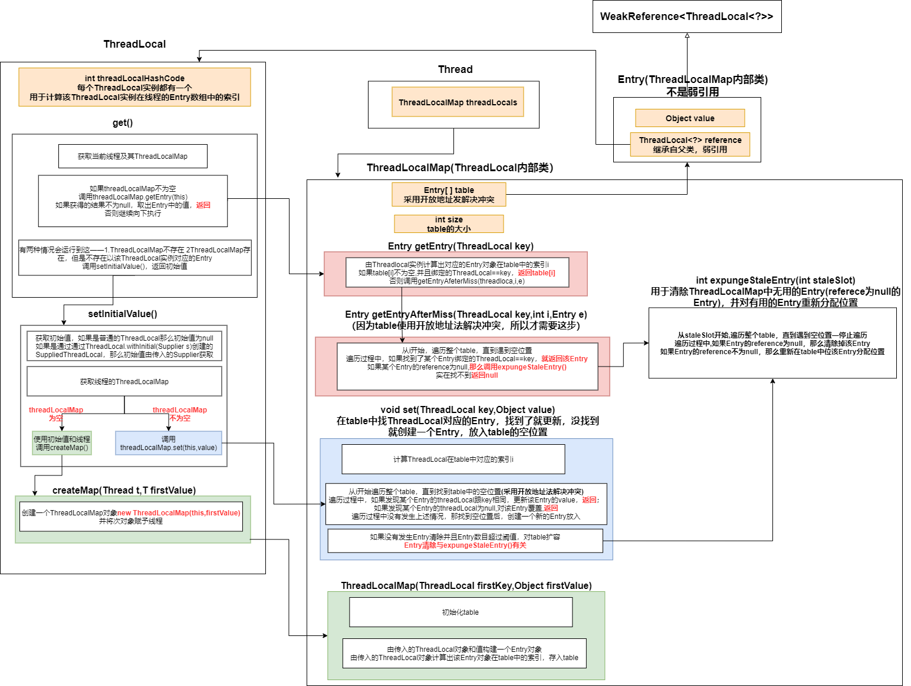
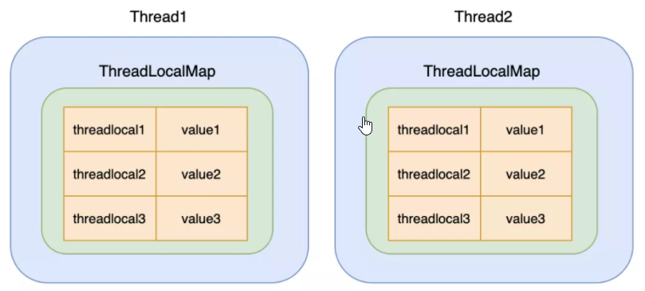
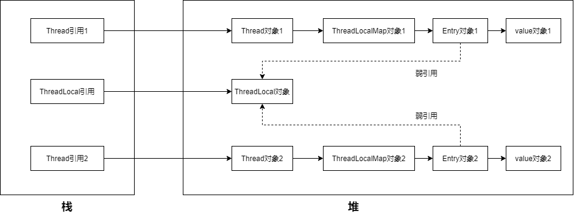
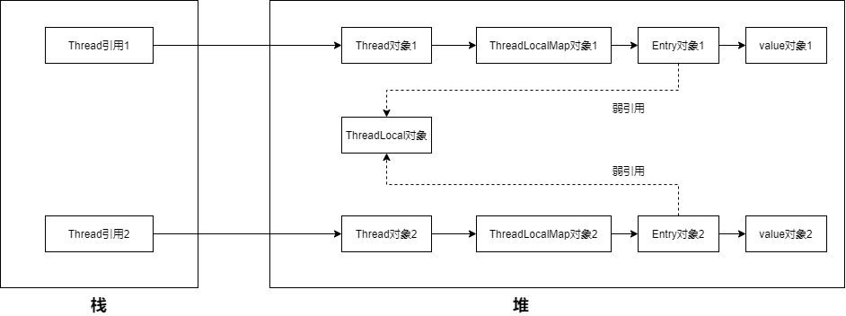

### 

[toc]

### 0. 类图和get()方法调用图

### 1. 类关系

* 每个Thread都有一个ThreadLocalMap，ThreadLocalMap中存储着多个Entry对象，这些Entry对象就是该线程独有的变量副本

* 每个Entry都可以绑定一个ThreadLocal实例**（ThreadLocal是key，Entry是value）**

* **ThreadLocalMap**中的 **Entry[ ]table**可以理解为一个键值对，key为ThreadLocal实例，value为Entry对象(表示线程在这个ThreadLocal实例上绑定的变量副本)，**table采用开放地址法解决冲突**

  

### 2. 一个线程调用ThreadLocal.get()

**有以下三种情况**

* **线程的ThreadLocalMap未初始化，为空**

  绿色执行路径

* **线程的ThreadLocalMap已初始化，但是该ThreadLocal实例对应的索引上不存在Entry**

  蓝色执行路径

* **线程的ThreadLocalMap已初始化，并且该ThreadLocal实例对应的索引上存在Entry**

  红色执行路径

### 3. 线程调用ThreadLocal.set()

**基本逻辑同get()**

### 4. ThreadLocal内存泄漏和Entry清除

#### 4.1 弱引用避免ThreadLocal内存泄漏

Entry继承自WeakReference，注意Entry不是弱引用，**Entry中的reference才是弱引用，这个弱引用避免了ThreadLocal的内存泄漏**

我们一般使用线程池，线程的生命周期很长，所以Thread引用会存在很长一段时间

如果我们不使用ThreadLocal了，将ThreadLocal引用设置为null（或者方法执行完毕，ThreadLocal引用弹出栈）

没有了ThreadLocal引用，ThreadLocal无法被访问到，线程就无法使用ThreadLocal，此时GC应该要回收掉ThreadLocal对象

若Entry的引用是强引用，会导致ThreadLocal无法被回收，**造成内存泄漏**

所以Entry的引用必须是弱引用，这样一旦发生GC，ThreadLocal就会被回收

#### 4.2 Entry清除

ThreadLocal一旦被回收，那么Entry对象的reference就为空，此时Entry也是无用的，应该被回收掉——**expungeStaleEntry()会回收掉那么reference为null的Entry对象(详情看源代码或者0. 类图和get()方法调用图)**

许多个地方都会调用**expungeStaleEntry()**来清除无用的Entry，例如get()和扩容

