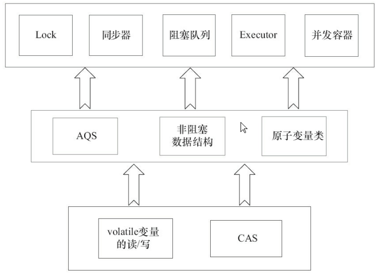

Java的CAS具有volatile读和volatile写的内存语义

所以通过CAS和volatile变量的读写可以实现Java线程的通信

1. A线程写volatile变量，随后B线程读这个volatile变量。 

2. A线程写volatile变量，随后B线程用CAS更新这个volatile变量。 

3. A线程用CAS更新一个volatile变量，随后B线程用CAS更新这个volatile变量。 

4. A线程用CAS更新一个volatile变量，随后B线程读这个volatile变量。

concurrent包有一个通用化的实现模式

1. 声明共享变量为volatile

2. 使用CAS的原子条件更新来实现线程之间的同步

   同时，配合以volatile的读/写和CAS所具有的volatile读和写的内存语义来实现线程之间的通信

