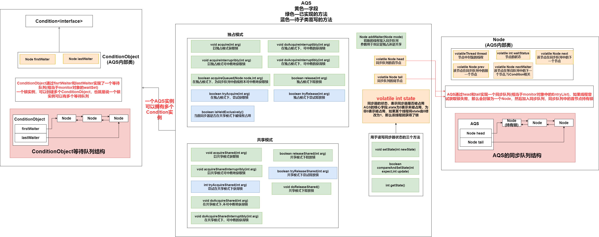
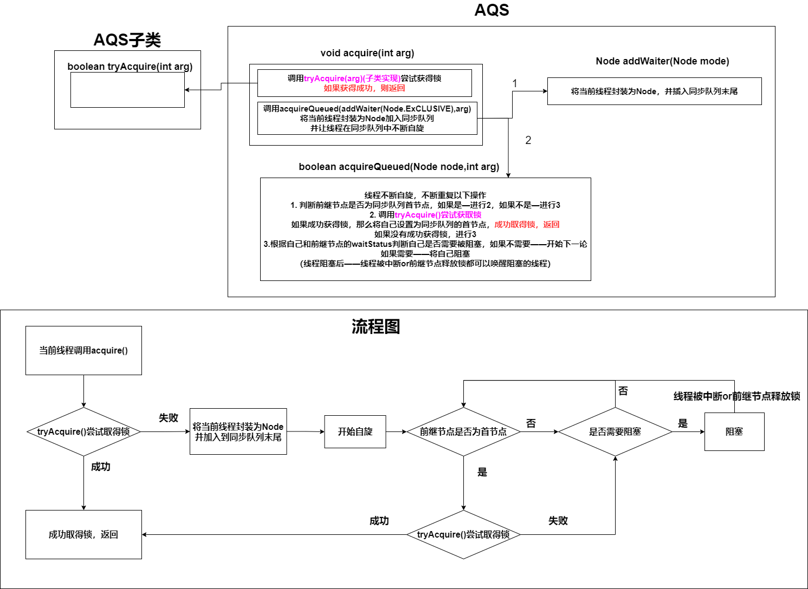
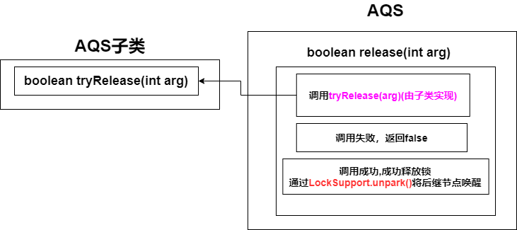
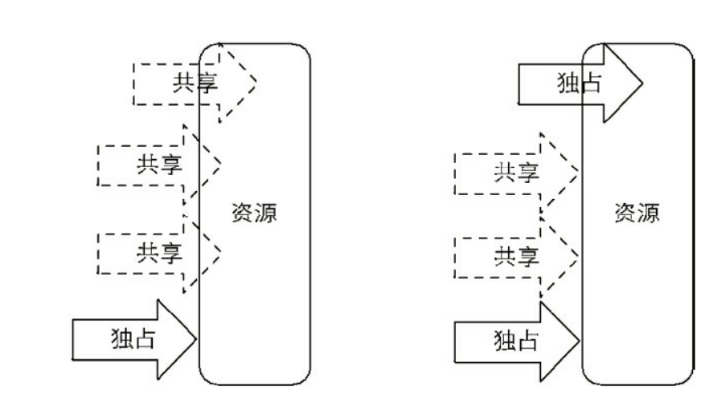
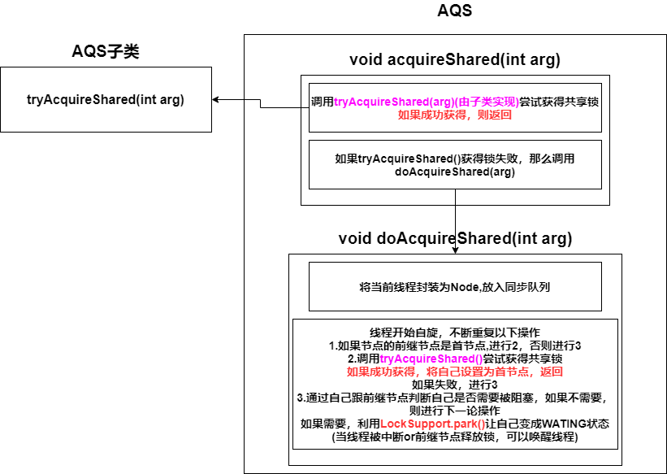
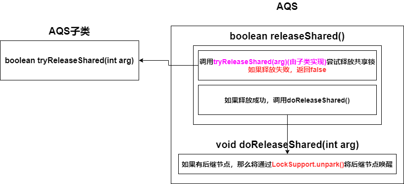

[toc]

## 1. Lock接口

### 1.1 Lock的定义

Lock接口定义了锁的API操作，用于实现java中锁机制

```java
public interface Lock {

    //如果锁可用，则获得锁后返回
    //如果锁不可用，那么当前线程会阻塞，直到获取锁后才会返回
    void lock();
    
    //可中断的获取锁(获得锁的过程可中断)
    //如果锁可用，则获得锁后返回
    //如果锁不可用，那么线程会阻塞获取锁，阻塞获取锁的过程是可中断的，受到中断会抛出InterruptedException
    void lockInterruptibly() throws InterruptedException;
    
    //非阻塞的尝试获得锁
    //如果锁可用，获得锁后，返回true
    //如果锁不可用，返回false
    boolean tryLock();

    //尝试获取锁(获得锁的过程可中断)
    //如果锁可用，获得锁后，返回true
    //如果锁不可用，那么在指定时间内会不断的尝试获得锁
    //如果成功获得锁——返回true
    //如果被中断——抛出InterruptedException
    //如果超时——返回false
    boolean tryLock(long time, TimeUnit unit) throws InterruptedException;

    //释放锁
    void unlock();

    //获取Condition对象，Condition对象与当前Lock对象绑定，当前线程只有获得了锁
    //才能调用该Condition对象的await()方法，而调用后，当前线程将释放锁，进入Conditon对象的等待队列中WATING
    //当其他线程调用Condition对象的signal()，才会唤醒Condition对象的等待队列中的WATING线程
    Condition newCondition();
}
```


### 1.2 Lock与sychronized的异同

* **共同点**

  * Lock的子类中有可重入锁

* **区别**

  * Lock显式的获取锁与释放锁

    sychronized隐式的获取锁与释放锁

  * Lock只能给代码块上锁

    sychronized可以给代码块，方法上锁

  * Lock依赖JDK实现

    sychronized依赖JVM实现

  * Lock有独占模式与共享模式，每个模式还分公平锁与非公平锁

    sychronized是独占模式的非公平锁

  * Lock是可中断的，线程在获得锁的过程中是可以影响中断

    sychronized不可中断，线程在阻塞等待锁的释放的时候，是不会响应中断的

  * Lock可以设定超时时间，超时会返回

    sychronized不行


## 2. Condition接口

### 2.1 Condition接口定义

```java
//Condition对象——1.相当于一个等待队列  2.必须与一个锁实例绑定  3.一个锁实例可以有多个Condition对象
//相当于monitor对象的WaitSet
//必须持有Condition对象绑定的锁，才可以调用其方法
public interface Condition {

    //相当于Object.wait()，可中断
    //持有锁的线程释放锁，进入等待队列中，线程状态更变为WATING，直到以下2种情况醒来
    //1.有其他线程调用等待队列的signal()或signalAll()
    //2.被其他线程中断
    //醒来后的线程会从等待队列移动到锁实例的同步队列，状态由WAITING更改为BLOKING
    void await() throws InterruptedException;

    //同await()，但是不可中断
    void awaitUninterruptibly();


    //同 await(),但是多了一种唤醒情况——等待超时（单位纳秒）
    long awaitNanos(long nanosTimeout) throws InterruptedException;

    //同 await(),但是多了一种唤醒情况——等待超时
    boolean await(long time, TimeUnit unit) throws InterruptedException;

   
    //同 await(),但是多了一种唤醒情况——等待超时
    boolean awaitUntil(Date deadline) throws InterruptedException;

    //将等待队列中的首节点移动到锁实例的同步队列，然后通过LockSupport唤醒线程
    void signal();

    //将等待队列中的全部节点移动到锁实例的同步队列，然后通过LockSupport唤醒线程
    void signalAll();
}

```

### 2.2 Condition与monitor的区别

* Condition——等待队列中等待的线程是可响应中断的

  monitor——等待队列中等待的线程不可响应中断

* Condition————等待队列中的线程可以指定等待到未来的某个具体时间点

  monitor——不支持


## 3. AQS

### 3.1 AQS介绍

AbstractQueuedSynchronizer抽象队列同步器——用于构建锁或其他同步组件的基础框架

子类通过继承AQS并实现它的抽象方法来实现锁

AQS支持两种模式——独占模式，共享模式


### 3.2 AQS结构



**AOS的核心字段——exclusiveOwnerThread**

* 独占模式下，持有锁的线程


**AQS最核心字段——state**

* **state**用于表示同步器的状态(可称为**同步状态**)，**锁的获得与释放就是state的修改**

* state=0——表示同步器没有被占用(没有线程持有锁)

  state!=0——表示同步器已被占用(有线程正在使用锁)

* 对于 **不可重入锁的实现子类**,state只有0,1

  对于 **可重入锁的实现子类**,state有0,1,2,3,4......

* **尝试获取锁**——检查state的值是否为0，如果为0尝试用CAS修改其值，如果不为0—则未取得锁

* **尝试释放锁**——将state的值CAS修改为0


**Node的状态——waitStatus**

* **CANCELLED(1)**：同步队列中的节点被中断或者超时
* **INITIAL(0)**：初始化状态
* **SIGNAL(-1)**：
* **CONDITION(-2)**：表示节点在等待队列中
* **PROPAGATE(-3)**:


**AQS有5个方法供子类锁去实现**

* **独占模式**
  * **boolean tryAcquire()**
  * **boolean tryRelease()**
  * **boolean IsHeldExclusively()**
* **共享模式**
  * **boolean tryAcquireShared()**
  * **boolean tryReleaseShared()**


### 3.3 AQS独占模式

**AQS独占模式下**

* 同步队列的首节点持有锁
* 如果线程尝试获取锁失败，那么会封装成一个Node，然后加入同步队列，并开始自旋
* 节点从同步队列移除的条件——前继节点为首节点 and 成功获得锁
* 节点释放锁时——会唤醒其后继节点


#### 3.3.1 获取锁



同步队列中，只有当节点的前继节点是首节点，才能尝试取得锁，原因如下

1. 首节点是取得锁的节点，首节点释放锁后，会唤醒其后继节点

   后继节点被唤醒后需要检查自己的前继节点是否为首节点

2. 维护同步队列的FIFO原则

#### 3.3.2 释放锁




#### 3.3.3 超时获取锁

过程基本与**获取锁**相同

区别在于

1. 每次自旋操作，在判断自己是否需要被阻塞之前，会优先判断是否已超时，如果超时了，就返回false

2. 如果需要被阻塞，还会检查剩余的时间有没有大于阈值

   如果大于阈值——通过LockSupport让线程进行超时阻塞

   ```java
   LockSupport.parkNanos(this, nanosTimeout);
   ```

### 3.4 AQS共享模式

#### 3.4.1 共享模式与独占模式的区别

**共享模式与独占模式的区别在于——同一时刻是否有多个线程可以同时获取到锁**



* **共享模式访问资源**——其他共享式访问允许，独占式访问不允许
* **独占模式访问资源**——其他访问一律不允许，被阻塞


#### 3.4.2 共享模式获得锁




#### 3.4.3 共享模式释放锁



