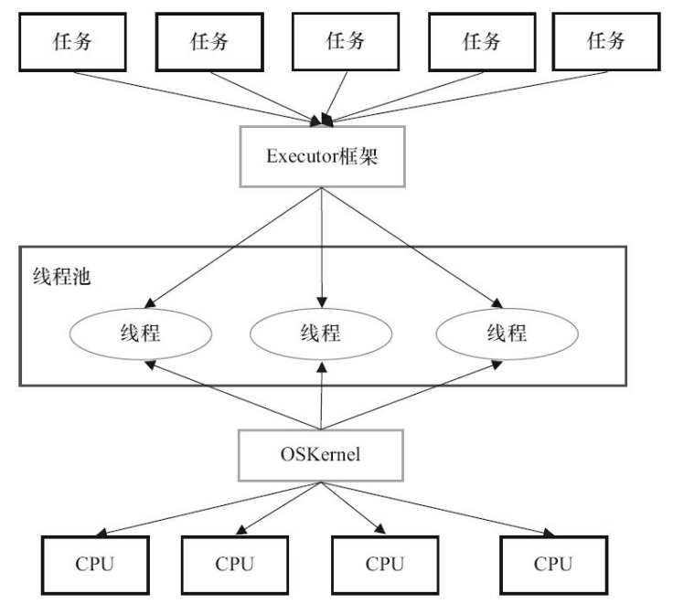
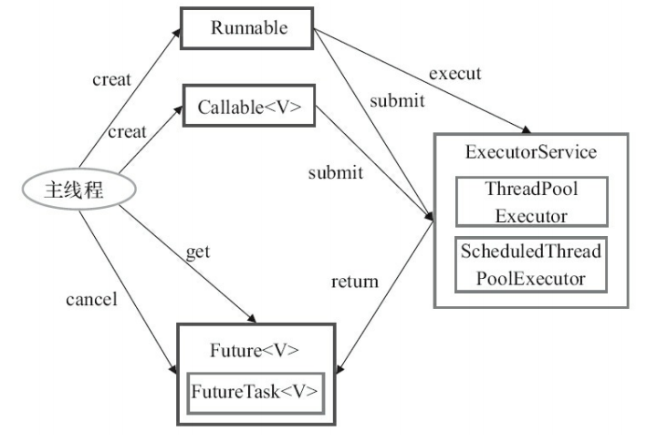
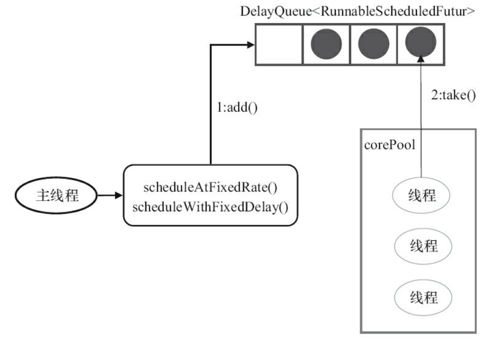
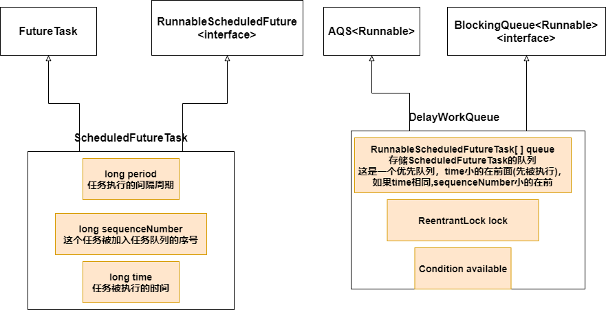
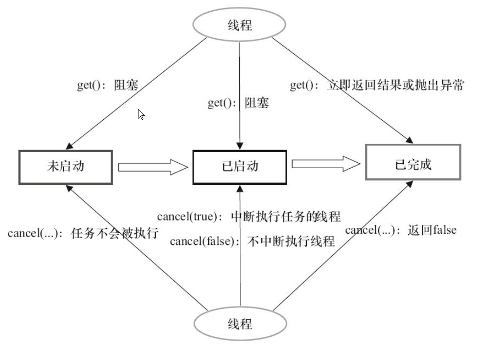

[toc]

**Java使用线程来执行异步任务**

### 1. Executor框架介绍

#### 1.1 任务的两级调度模型

应用程序通过Executor框架控制上层的调度

下层的调度有OS内核控制，不受应用程序控制



#### 1.2 Executor架构结构

Executor架构分为**三个部分**

* **任务**

* **任务的返回结果**

* **执行任务**

  

  
  
  


### 2. Future接口

用于控制任务的执行，获得异步任务的执行状态，执行结果

向线程池提交Callable任务，线程池会返回一个Future对象供我们查看异步任务的执行状态，执行结果

```java
Future<String>future=executor.submit(new Callable<String>(){});
//上下等价

RunnableFuture<String>future=new FutureTask<String>(异步任务);
executor.execute(future);
```


### 3. Executors工具类

#### 3.1 将Runnable任务转换为Callable任务

Runnable任务是没有返回结果的，Callable有返回结果，Executors允许将Runnable任务转换为Callable任务

```java
//生成的Callable任务的执行结果为result
public static <T> Callable<T> callable(Runnable task, T result)
     
//生成的Callable任务的执行结果为null
public static Callable<Object> callable(Runnable task)
```


#### 3.2 创建ThreadPoolExecutor

Executors提供三种类型ThreadPoolExecutor的构造API(《阿里巴巴Java开发手册》中不推荐使用Executors创建，推荐手动创建)

* **SingleThreadExecutor**
* **FixedThreadPool**
* **CachedThreadPool**

```java
    public static ExecutorService newSingleThreadExecutor() {
        return new FinalizableDelegatedExecutorService
            (new ThreadPoolExecutor(1, 1,
                                    0L, TimeUnit.MILLISECONDS,
                                    new LinkedBlockingQueue<Runnable>()));
    }

    public static ExecutorService newSingleThreadExecutor(ThreadFactory threadFactory) {
        return new FinalizableDelegatedExecutorService
            (new ThreadPoolExecutor(1, 1,
                                    0L, TimeUnit.MILLISECONDS,
                                    new LinkedBlockingQueue<Runnable>(),
                                    threadFactory));
    }

-------------------------
    public static ExecutorService newFixedThreadPool(int nThreads) {
        return new ThreadPoolExecutor(nThreads, nThreads,
                                      0L, TimeUnit.MILLISECONDS,
                                      new LinkedBlockingQueue<Runnable>());
    }

    public static ExecutorService newFixedThreadPool(int nThreads, ThreadFactory threadFactory) {
        return new ThreadPoolExecutor(nThreads, nThreads,
                                      0L, TimeUnit.MILLISECONDS,
                                      new LinkedBlockingQueue<Runnable>(),
                                      threadFactory);
    }

-------------------------
    public static ExecutorService newCachedThreadPool() {
        return new ThreadPoolExecutor(0, Integer.MAX_VALUE,
                                      60L, TimeUnit.SECONDS,
                                      new SynchronousQueue<Runnable>());
    }

    public static ExecutorService newCachedThreadPool(ThreadFactory threadFactory) {
        return new ThreadPoolExecutor(0, Integer.MAX_VALUE,
                                      60L, TimeUnit.SECONDS,
                                      new SynchronousQueue<Runnable>(),
                                      threadFactory);
    }

```


#### 3.3 创建ScheduledThreadPoolExecutor

Executors提供两种类型ScheduledExecutorService的构造API(《阿里巴巴Java开发手册》中不推荐使用Executors创建，推荐手动创建)

* **SingleThreadScheduledExecutor**
* **ScheduledThreadPool**

```java
    public static ScheduledExecutorService newSingleThreadScheduledExecutor() {
        return new DelegatedScheduledExecutorService
            (new ScheduledThreadPoolExecutor(1));
    }

    public static ScheduledExecutorService newSingleThreadScheduledExecutor(ThreadFactory threadFactory) {
        return new DelegatedScheduledExecutorService
            (new ScheduledThreadPoolExecutor(1, threadFactory));
    }
----------------------------
    public static ScheduledExecutorService newScheduledThreadPool(int corePoolSize) {
        return new ScheduledThreadPoolExecutor(corePoolSize);
    }

    public static ScheduledExecutorService newScheduledThreadPool(
            int corePoolSize, ThreadFactory threadFactory) {
        return new ScheduledThreadPoolExecutor(corePoolSize, threadFactory);
    }
```


### 4. ThreadPoolExecutor详解


#### 4.1 手动创建线程池

```java
    public ThreadPoolExecutor(int corePoolSize,
                              int maximumPoolSize,
                              long keepAliveTime,
                              TimeUnit unit,
                              BlockingQueue<Runnable> workQueue,
                              ThreadFactory threadFactory,
                              RejectedExecutionHandler handler) {
        //略
        this.corePoolSize = corePoolSize;
        this.maximumPoolSize = maximumPoolSize;
        this.workQueue = workQueue;
        this.keepAliveTime = unit.toNanos(keepAliveTime);
        this.threadFactory = threadFactory;
        this.handler = handler;
    }
```

**参数介绍**

* **corePoolSize**：初始化ThreadPoolExecutor中的corePoolSize，**指定核心线程的数量**

* **maximumPoolSize**：初始化ThreadPoolExecutor中的maximunPoolSize，**代表线程池中允许的最大线程数**

* **keepAliveTime**：初始化ThreadPoolExecutor中的keepAliveTime，**空闲线程允许存活的最大时间**

* **unit**：keepAliveTime的单位

* **workQueue**：初始化ThreadPoolExecutor中的workQueue，**任务队列**

* **threadFactory**：初始化ThreadPoolExecutor中的threadFactory，**线程工厂，用于创建线程**

* **handler**：初始化ThreadPoolExecutor中的handler，**拒绝策略**

  **ThreadPoolExecutor内置4种拒绝策略**

  * **AbortPolicy**：直接抛出异常。 
  * **CallerRunsPolicy**：只用调用者所在线程来运行任务。 
  * **DiscardOldestPolicy**：丢弃队列里最近的一个任务，并执行当前任务。 
  * **DiscardPolicy**：不处理，丢弃掉。 


#### 4.2 execute()执行过程

过程.png)

#### 4.3 Worker工作过程

* **thread**：由线程池的threadFactory创建
* **firstTask**：创建Worker的时，可以指定firstTask，如果firstTask不为null，那么线程优先执行firstTask，如果firstTask为null，那么线程会从 **workQueue**中获取任务执行

**线程执行任务有2中情况**

* **创建Worker时，分配的firstTask**
* **线程从workQueue中获取的任务**

**如果Worker获得的任务为null，那么该Worker即将被销毁**

线程分为核心线程与非核心线程

非核心线程在getTask()种循环获取任务时，每轮循环都会进行超时判断，如果超时返回null

核心线程在getTask()种循环获取任务时，如果allowCoreThreadTimeout为false，那么不会进行超时判断，如果allowCoreThreadTimeout为false，那么会进行超时判断，如果超时也是返回null


#### 4.4 关闭线程池

* **void shutdown()——缓慢关闭**

  1. 取得全局锁，并上锁
  2. 将线程池的状态修改为 **SHUTDOWN**
  3. 对线程池中的所有线程调用其interrupt()传递中断信号
  4. 释放锁
  5. 调用tryTerminal()尝试终止线程池(只有以下两种情况才有可能成功)
     * 线程池状态为SHUTDOWN，线程池没有线程，任务队列为空
     * 线程池状态为STOP，其线程池中无线程

  **调用shutdown()后，线程池的状态变为SHUTDOWN，第5步tryTerminal()大多数情况不会成功**

  **线程池状态变为SHUTDOWN后，线程池不会再接受新的任务，但已经接受的任务仍会继续执行，当所有任务执行完**

  **线程池中的线程检测到线程池状态为SHUTDOWN并且任务队列空了，那么线程会执行退出操作**

  **退出操作中，每个线程都会调用一次tryTerminal()，最后一个消亡的线程调用tryTerminal()就能成功关闭线程池**

* **List<Runnable> shutdownNow()——快速关闭**

  1. 取得全局锁，并上锁
  2. 将线程池的状态修改为 **STOP**
  3. 对线程池中的所有线程调用其interrupt()传递中断信号
  4. 移除任务队列中的所有未执行的任务
  5. 释放锁
  6. 调用tryTerminal()尝试终止线程池(只有以下两种情况才有可能成功)
     * 线程池状态为SHUTDOWN，线程池没有线程，任务队列为空
     * 线程池状态为STOP，其线程池中无线程

  **shutdownNow()移除任务队列中所有未执行的任务，从而实现快速关闭线程池**

  **线程池中的线程检测到线程池状态为STOP并且任务队列为空，就会执行退出操作**

  **退出操作中，每个线程都会调用一次tryTerminal()，最后一个消亡的线程调用tryTerminal()就能成功关闭线程池**


### 5. ScheduledThreadPoolExecutor

* 继承自**ThreadPoolExecutor**，用于在给定的延迟后执行任务or执行定时任务
* 任务队列默认是用 **DelayWorkQueue**
* 提交任务后，任务封装为**ScheduledFutureTask**后，直接进入任务队列**DelayWorkQueue**，然后由线程从任务队列**DelayWorkQueue**中获取**ScheduledFutureTask**执行


#### 5.1 任务类图


#### 5.2 任务提交

ScheduledThreadPoolExecutor中

**schedule()**，**scheduleAtFixedRate()**，**scheduleWithFixedDelay()**，**submit()**,**execute()**的逻辑基本相同

接下来以schedule()为例进行讲解

.png)


**ScheduledThreadPool中，任务封装为ScheduledFutureTask后，直接进入任务队列，然后由线程从任务队列中获取ScheduledFutureTask执行**



#### 5.3 任务的执行

* DelayWorkQueue和ScheduledFutureTask的结构

  

* 任务任务执行的步骤

  

  1. 线程从DelayWorkQueue中获取超时的ScheduledFutureTask

     (从queue中获取queue[0]，如果没有会阻塞等待，然后检查任务是否超时,如果任务没超时，会阻塞直到任务超时)

  2. 线程执行任务

  3. 线程修改ScheduledFutureTask的time为下一次执行的时间

  4. 线程将ScheduledFutureTask重新放回DelayWorkQueue

### 

### 6. FutureTask

1. FutureTask可以由调用线程直接执行(FutureTask.run())（这种方式不会创建新的线程），也可以提交给线程池执行
2. FutureTask跟Future一样，可以控制任务的执行状态，获得任务的执行结果


#### 6.1 FutureTask状态迁移图


