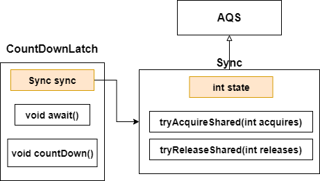
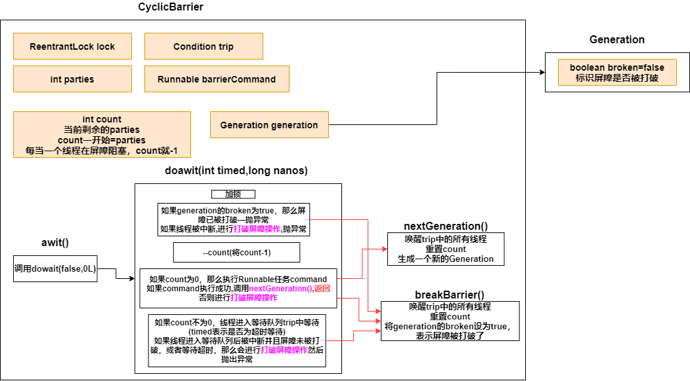

[toc]

### 1. CountDownLatch

允许一个或多个线程等待其他线程完成操作

#### 1.1 类图



#### 1.2 方法介绍

* **public CountDownLatch(int count)**

  用于初始化state

* **await()**

  如果state不为0，线程进入WATING状态**(通过LockSupport)**，直到state变为0（可中断）

  如果state为0，那么线程不会WATING

* **countDown()**

  将state-1，如果state减为0——唤醒所有WATING线程

#### 1.3 方法详解

* **await()**

  底层调用的是AQS共享锁加锁的那一套

  Sync中实现了 **tryAcquireShared(int acquires)**——如果state为0，那么取得共享锁，如果state不为0，那么取得共享锁失败，后续会通过 **LockSupport**进入WATING状态

* **countDown()**

  底层调用的是AQS释放共享锁的那一套

  Sync中实现了 **tryReleaseShared(int releases)**——如果state为0，返回false，不会释放锁，如果state不为0，将state-1

  如果state-1后为0，那么返回true，成功释放锁，唤醒所有WATING的线程

  如果state-1后不为0，那么返回false，不会释放锁


### 2. CyclicBarrier

当一组线程到达CyclicBarrier时被阻塞，直到最后一个线程到达屏障时，所有被阻塞的线程才能继续运行

(count初始值为parties，每当一个线程调用CyclicBarrier的await()，就会让count-1,如果count-1后不为0，那么线程进入WATING

如果count-1后为0，就会打破屏障唤醒所有WATING的线程)

#### 2.1 类图


#### 2.2 构造方法

```java
    public CyclicBarrier(int parties) {
        this(parties, null);
    }
    
    //初始化parties,count,barrierCommand
    public CyclicBarrier(int parties, Runnable barrierAction) {
        if (parties <= 0) throw new IllegalArgumentException();
        this.parties = parties;
        this.count = parties;
        this.barrierCommand = barrierAction;
    }
```


#### 2.3 await()

**可中断**



#### 2.4 reset()

1. 加锁
2. 调用nextGeneration()
3. 调用breakBarrier()
4. 释放锁

### 3. CountDownLatch与CyclicBarrier的区别

1. CountDownLatch依靠AQS实现，CyclicBarrier依靠Lock接口与Condition接口实现
2. CountDownLatch只能使用一次，CyclicBarrier可以用reset()重置