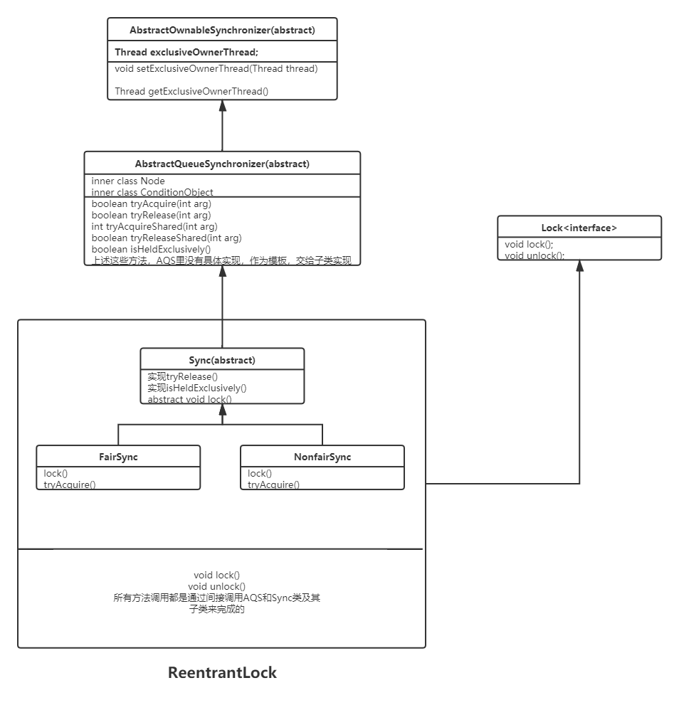

**1. AQS类图结构**
* AbstractOwnableSynchronizer  
  * AbstractQueueSynchronizer  
    * Sync(CountDownLatch内部类)
    * Worker(ThreadPoolExecutor内部类)
    * Sync(ReentrantLock内部抽象类) 
      * FairSync(ReentrantLock内部类)
      * NonfairSync(ReentrantLock内部类)  
    * Sync(ReentrantReadWriteLock内部抽象类)
      * FairSync(ReentrantReadWriteLock内部类)
      * NonfairSync(ReentrantReadWriteLock内部类)  
    * Sync(Semaphore内部抽象类)   
      * FairSync(Semaphore内部类)
      * NonfairSync(Semaphore内部类)  
    
**2. AQS与ReentrantLock的关系**  
ReentrantLock的内部类FairSync和NonfairSync是AQS的子类  

**3. ReentrantLock与AQS详细分析**  


* **AbstractOwnableSynchronizer**       
  抽象类，设置独占锁的线程，获取独占锁的线程的方法   
* **AbstractQueuedSynchronizer**   
  抽象类，AQS框架核心类，其内部以虚拟队列的方式管理线程的锁获取与锁释放，    
  其中获取锁(tryAcquire方法)和释放锁(tryRelease方法)并没有提供默认实现，需要子类重写这两个方法实现具体逻辑，
  目的是使开发人员可以自由定义获取锁以及释放锁的方式。
  
* **Sync**    
  ReentrantLock的内部抽象类，继承自AbstractQueuedSynchronizer   
  实现了释放锁的操作(tryRelease()方法)，并提供了lock抽象方法，由其子类实现。
  
* **NonfairSync**     
  ReentrantLock的内部类，继承自Sync，非公平锁的实现类，实现了上锁方法(lock())和获取锁方法(tryAcquired())
* **FairSync**      
  ReentrantLock的内部类，继承自Sync，公平锁的实现类,实现了上锁方法(lock())和获取锁方法(tryAcquired())  
* **ReentrantLock**    
  实现了Lock接口，创建时根据fair参数，来决定内部使用FairSync还是NonfairSync    
  该类中所有方法的调用都是通过间接调用AQS和Sync类及其子类来完成的   
  


**4. AQS的模板作用**     
AQS虽然是抽象类，但是源码中没有一个抽象方法   
AQS内部除了提供并发操作核心方法以及同步队列操作，等待队列操作外，还提供了一些模板方法供子类实现(如加锁，解锁)   
因为AQS作为基础组件，封装的是核心并发操作，但分为两种模式——共享模式，独占模式，这两种模式的加锁，解锁操作是不一样的    
所以AQS只关注内部公共方法实现，并不关心外部不同模式的实现，所以提供了模板方法给子类使用,模板如下  
```java
//AQS中提供的主要模板方法，由子类实现。
public abstract class AbstractQueuedSynchronizer
    extends AbstractOwnableSynchronizer{

    //独占模式下获取锁的方法
    protected boolean tryAcquire(int arg) {
        throw new UnsupportedOperationException();
    }

    //独占模式下解锁的方法
    protected boolean tryRelease(int arg) {
        throw new UnsupportedOperationException();
    }

    //共享模式下获取锁的方法
    protected int tryAcquireShared(int arg) {
        throw new UnsupportedOperationException();
    }

    //共享模式下解锁的方法
    protected boolean tryReleaseShared(int arg) {
        throw new UnsupportedOperationException();
    }
    //判断是否为持有独占锁
    protected boolean isHeldExclusively() {
        throw new UnsupportedOperationException();
    }

}
```