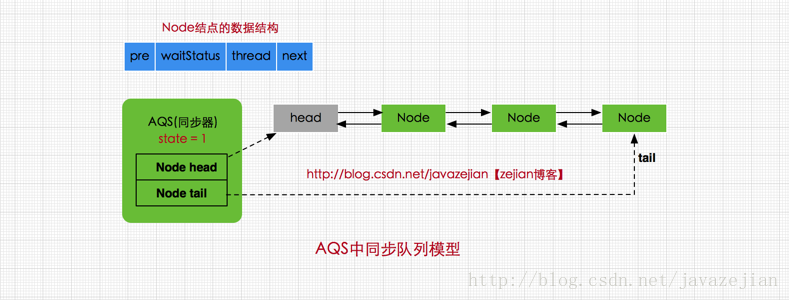

AbstractQueuedSynchronizer抽象队列同步器——用来构建锁或其他同步组件的基础架构
```java
public abstract class AbstractQueuedSynchronizer
    extends AbstractOwnableSynchronizer{
//指向同步队列队头
private transient volatile Node head;

//指向同步的队尾
private transient volatile Node tail;

//同步状态，0代表锁未被占用，1代表锁已被占用
private volatile int state;

//省略其他代码......
}
```
* 内部类Node  
  * 封装了Thread,一个Node对象就表示一个Thread 
  * 通过Node和链表结构，形成一个FIFO的**同步队列**(模仿minotor对象的_EntryList)  
    ——来完成线程获取锁的排队工作 
  * Node源代码  
    ```java
    static final class Node {
        //共享模式——一个锁允许多个线程同时操作
        static final Node SHARED = new Node();
    
        //独占模式——一个时间段只有一个线程可以对锁进行操作，其余线程要排队等待
        static final Node EXCLUSIVE = null;
    
        //标识线程已处于结束状态，需要从队列取消该Node
        static final int CANCELLED =  1;
    
        //等待被唤醒状态，当前持有锁的节点的后继节点——就是SIGNAL状态
        //当持有锁的节点释放锁后，状态为SIGNAL的节点会被唤醒，并取得锁
        static final int SIGNAL    = -1;
    
        //条件状态，该节点处于等待队列中(调用了await()的Node)
        static final int CONDITION = -2;
    
        //在共享模式中使用表示获得的同步状态会被传播
        static final int PROPAGATE = -3;
    
        //等待状态,存在CANCELLED、SIGNAL、CONDITION、PROPAGATE 4种
        volatile int waitStatus;
    
        //同步队列中前驱结点
        volatile Node prev;
    
        //同步队列中后继结点
        volatile Node next;
    
        //请求锁的线程(Node封装的线程)
        volatile Thread thread;
    
        //等待队列中的后继结点，这个与Condition有关，稍后会分析
        Node nextWaiter;
    
        //判断是否为共享模式
        final boolean isShared() {
            return nextWaiter == SHARED;
        }
    
        //获取前驱结点
        final Node predecessor() throws NullPointerException {
            Node p = prev;
            if (p == null)
                throw new NullPointerException();
            else
                return p;
        }
        //.....
    }
    ```

* 内部类ConditionObject(等待队列，模仿minotor对象的_WaitSet) 
  * 通过Condition调用await()方法后，线程将会加入**等待队列**中，   
    而通过Condition调用signal()方法后，线程将从等待队列转移动同步队列中进行锁竞争 
    

* 内部有一个int成员变量state来控制同步状态  
  * state=0——没有线程占有公共资源的锁
  * state=1——有线程目前正在使用共享变量，其他线程必须加入同步队列进行等待  
  

* 变量head——指向同步队列第一个Node
  

* 变量tail——指向同步队列中的最后一个Node



当一个线程调用lock()时   
如果AQS的state为0，那么该线程可以取得锁，同时将state设为1  
如果AQS的state为1，表示锁被其他线程持有，那么该线程会被封装为Node对象，加入同步队列中  

***
```java
public interface Condition {
    
    void await() throws InterruptedException;

    void awaitUninterruptibly();

    long awaitNanos(long nanosTimeout) throws InterruptedException;
    
    boolean await(long time, TimeUnit unit) throws InterruptedException;
    
    boolean awaitUntil(Date deadline) throws InterruptedException;
    
    void signal();

    void signalAll();
}
```