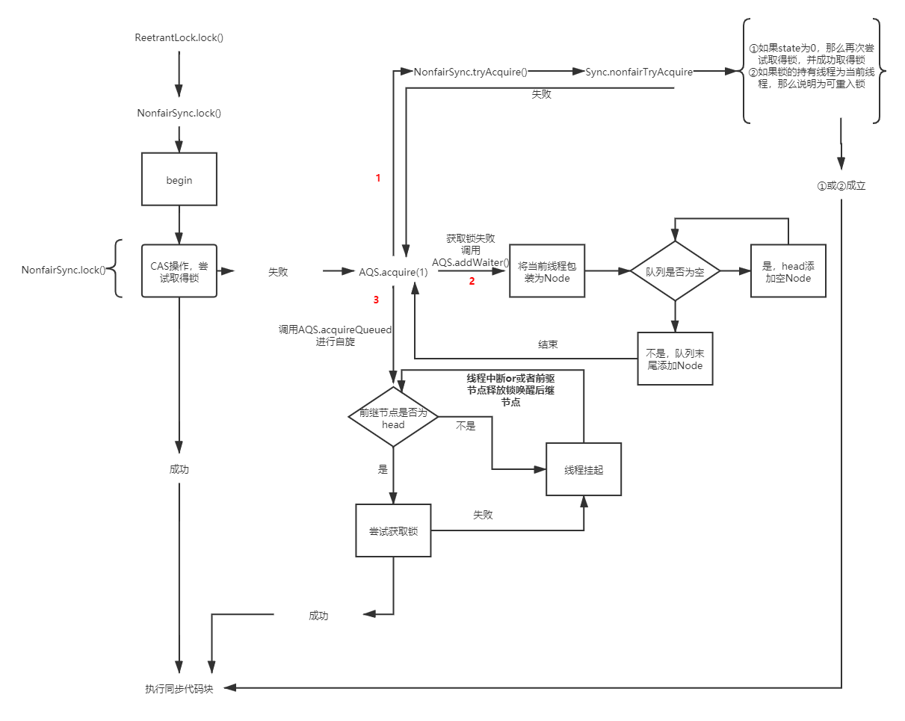
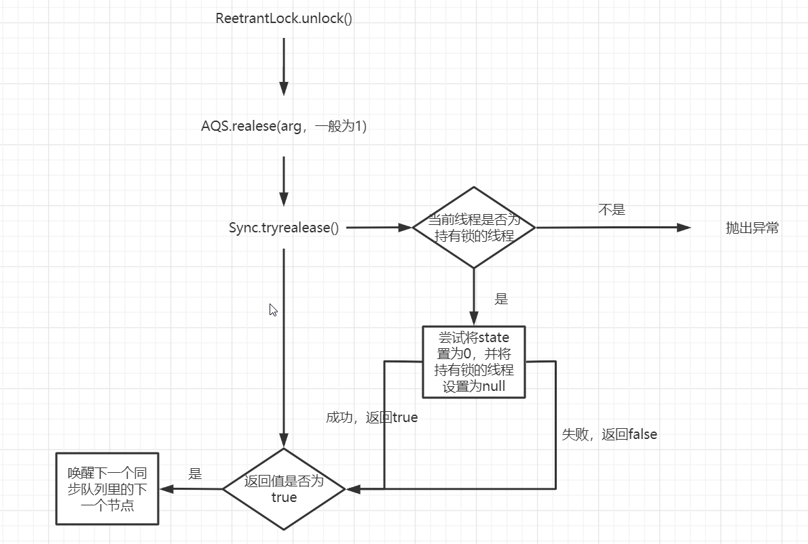
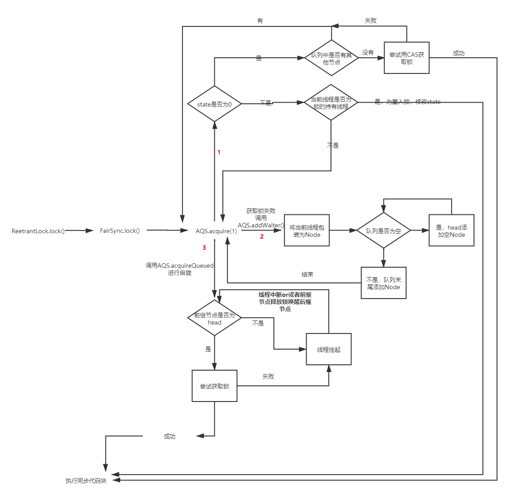

* AQS
  * ReentrantLock
     * Sync
        * FairSync
        * NonfairSync   
   
ReentrantLock的lock()和unlock()的实现依赖与FairSync,NonfairSync,Sync,ReentrantLock,AQS     
lock()——调用的是FairSync或NonfairSync中的lock()     
unlock()——调用的是AQS里的release()，release()中又会调用Sync的tryRelease()    
***
**非公平锁**    

* lock()流程图如下，详细看源代码
  

* unlock()流程图如下，详细看源代码   
  
***
**公平锁**  
* lock()流程图如下，详细看源代码
  

* unlock()流程图如下，详细看源代码   
    
  
***
**公平锁和非公平锁的区别**   
非公平锁——不管队列中是否有其他节点，当前线程都会用CAS操作来舱室取得锁    
公平锁——队列中没有其他节点的时候，当前线程才会使用CAS操作来尝试取得锁，公平锁的获取顺序是完全遵循时间上的FIFO规则，也就是说先请求的线程一定会先获取锁，后来的线程肯定需要排队