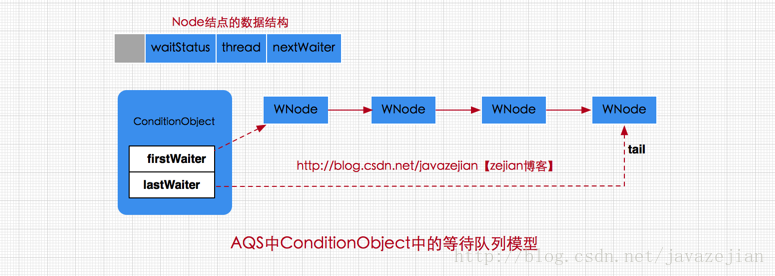

```java
public interface Condition {

 /**
  * 使当前线程进入AQS的ConditionObject(等待队列)直到被通知(signal)或中断
  * 当其他线程调用singal()或singalAll()方法时，该线程将被唤醒
  * 当其他线程调用interrupt()方法中断当前线程
  * await()相当于synchronized等待唤醒机制中的wait()方法
  */
 void await() throws InterruptedException;

 //当前线程进入AQS的ConditionObject(等待队列)，直到被唤醒，该方法不响应中断要求
 void awaitUninterruptibly();

 //调用该方法，当前线程进入AQS的ConditionObject(等待队列)，直到被唤醒或被中断或超时
 //其中nanosTimeout指的等待超时时间，单位纳秒
 long awaitNanos(long nanosTimeout) throws InterruptedException;

  //同awaitNanos，但可以指明时间单位
  boolean await(long time, TimeUnit unit) throws InterruptedException;

 //调用该方法当前线程进入AQS的ConditionObject(等待队列)，直到被唤醒、中断或到达某个时
 //间期限(deadline),如果没到指定时间就被唤醒，返回true，其他情况返回false
  boolean awaitUntil(Date deadline) throws InterruptedException;

 //唤醒一个等待在Condition上的线程，该线程从等待方法返回前必须
 //获取与Condition相关联的锁，功能与notify()相同
  void signal();

 //唤醒所有等待在Condition上的线程，该线程从等待方法返回前必须
 //获取与Condition相关联的锁，功能与notifyAll()相同
  void signalAll();
}
```


* AQS里面有个内部类——ConditionObject来存储等待队列(模仿minotor对象的_WaitSet)   
* ConditionObject实现了Condition接口  

    
* 某线程调用ConditionObject对象的await()后，该线程将会加入**该ConditionObject对象的等待队列**中           
某线程调用ConditionObject对象的signal()后，就会唤醒该ConditionObject对象的等待队列中的某个线程   
```
ReentrantLock lock=new ReentrantLock();
Condition c=lock.newCondition();//创建一个ConditionObject并返回；、
某线程调用ConditionObject对象的await()后，该线程将会加入该ConditionObject对象的等待队列中，      
某线程调用ConditionObject对象的signal()后，就会唤醒该ConditionObject对象的等待队列中的某个线程线程
```  
* ```java
    public class ConditionObject implements Condition, java.io.Serializable {
        //等待队列中的第一个节点
        private transient Node firstWaiter;
        //等待队列中的第二个节点  
        private transient Node lastWaiter;
        //无参构造
        public ConditionObject() {
        }
    }
  ```
* 通过源代码，可以看出，ContionObject中也是以**链表**来维持一个等待队列     
  firstWaiter指向等待队列中的第一个节点   
  lastWaiter指向等待队列中的最后一个节点   
  等待队列中结点的状态只有两种即CANCELLED和CONDITION    
  前者表示**线程已结束需要从等待队列中移除**    
  后者表示**结点等待被唤醒**
  
* 即使我们只持有一个Lock对象，
  我们可以通过多次使用lock.newCondtion()创建多个ConditionObject对象   
  这样，就相当于有个多个等待队列   
*   
    
