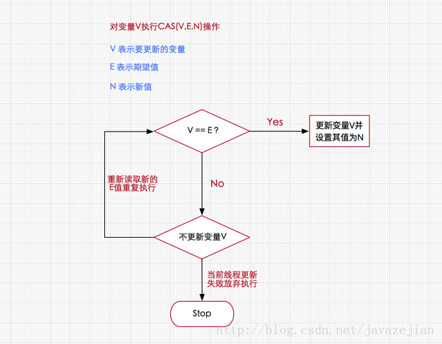

1. **悲观锁和乐观锁**  
* 悲观锁 ： 认为访问资源时不会发生冲突
* 乐观锁 ： 认为访问资源时会发生冲突——加锁  

2. **CAS**   
CAS是乐观锁实现的关键   
   
* CAS(Compare And Swap)有三个参数
  * V——要更新的变量
  * E——预期值
  * N——新值  
   
 
* CAS流程   
        
  CAS会检查V的值是否为E，如果是，就执行更新操作  
  如果不是，那么CAS可以放弃执行，也可以进入自旋状态(不断尝试CAS操作，不会挂起线程，继续消耗CPU资源)
  

* CAS是原子指令

