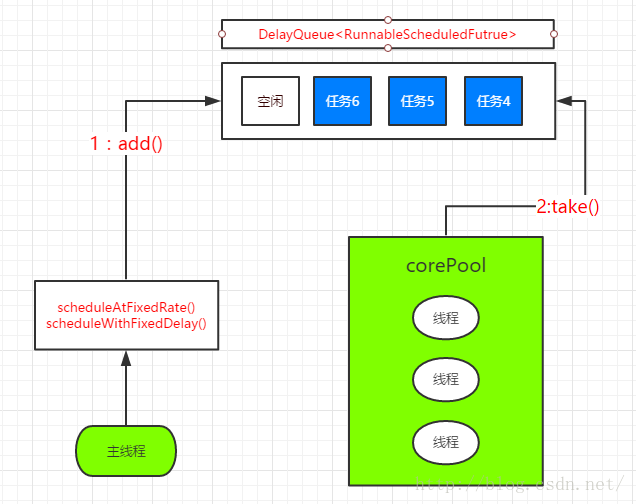

**1. 两级调度模型**   
   上层，Java多线程把程序分为若干任务，然后使用Executor框架把任务映射为固定数量的线程；   
   在底层，由操作系统把线程映射到硬件上
      
   
***
**2. Executor框架结构**      
    
    
* **任务创建**——任务需要实现接口Runnable或Callable   
* **任务的执行**——执行机制的核心接口Executor，ExecutorService    
  Exrcutor有两个关键类——ThreadPoolExecutor和ScheduledThreadPoolExecutor
* **执行的结果**    
   ```
    public interface Executor {
        void execute(Runnable command);
    }
   
   
   public interface ExecutorService extends Executor {
    <T> Future<T> submit(Callable<T> task);
    <T> Future<T> submit(Runnable task, T result);
    Future<?> submit(Runnable task);
   ```  
  * Executor提供了execute()来执行Runnable任务，无返回值
  * ExecutorService提供了sublit()来执行Runnable任务和Callable任务，返回值存储在Future中  


***
**3. ThreadPoolExecutor**      
```
public ThreadPoolExecutor(int corePoolSize,
                              int maximumPoolSize,
                              long keepAliveTime,
                              TimeUnit unit,
                              BlockingQueue<Runnable> workQueue,
                              ThreadFactory threadFactory,
                              RejectedExecutionHandler handler) 
```
* **corePoolSize** : 线程池的核心线程数，默认情况下，核心线程数会一直在线程池中存活，即使它们处理闲置状态。
* **maximumPoolSize** : 线程池所能容纳的最大线程数量(核心线程数+非核心线程数)
* **keepAliveTime** : 非核心线程闲置时的超时时长，超过这个时长，非核心线程就会被回收。
  当 ThreadPoolExecutor的allowCoreThreadTimeOut属性设置为true时，keepAliveTime同样会作用于核心线程。
* **unit** : keepAliveTime的单位
* **workQueue** : 任务队列，提交到ThreadPool的任务会在存储在任务队列
* **threadFactory** : 线程工厂，为线程池提供创建新线程的功能
* **handler** : 拒绝策略，表示当 ThreadPoolExecutor已经关闭或者 ThreadPoolExecutor已经饱和时（达到了最大线程池大小而且工作队列已经满），
  execute方法将会调用Handler的rejectExecution方法来通知调用者，默认情况 下是抛出一个RejectExecutionException异常

    


接下来介绍几种常见的线程池(都是基于ThreadPoolExecutor)——见笔记2，3，4   
* FixedThreadPool
* CachedThreadPool  
* SingleThreadExecutor  

***  
**4. ScheduledThreadPool**    
* ScheduledThreadPool是ThreadPoolExecutor的子类   
  主要用来在给定的延迟之后执行任务，或者定期执行任务  
  

* 创建ScheduledThreadPool   
  * 通过工厂类Executors创建
  * 可以创建两种ScheduledThreadPool  
    * ScheduledThreadPoolExecutor：可以执行并行任务也就是多条线程同时执行。  
      ```
        public static ScheduledExecutorService newScheduledThreadPool(int corePoolSize)
        public static ScheduledExecutorService newScheduledThreadPool(int corePoolSize, ThreadFactory threadFactory)
      ```
    * SingleThreadScheduledExecutor：可以执行单条线程。
      ```
        public static ScheduledExecutorService newSingleThreadScheduledExecutor()
        public static ScheduledExecutorService newSingleThreadScheduledExecutor(ThreadFactory threadFactory)
      ```
    
  * 创建SingleThreadScheduledExecutor——代码上就是创建corePoolSize=1的ScheduledThreadPool
  * 创建ScheduledThreadPoolExecutor
    ```
    public static ScheduledExecutorService newScheduledThreadPool(int corePoolSize) {
        return new ScheduledThreadPoolExecutor(corePoolSize);
    }
    
    public ScheduledThreadPoolExecutor(int corePoolSize) {
        super(corePoolSize, Integer.MAX_VALUE, 0, NANOSECONDS,
              new DelayedWorkQueue());
    }
    
    public ThreadPoolExecutor(int corePoolSize,
                              int maximumPoolSize,
                              long keepAliveTime,
                              TimeUnit unit,
                              BlockingQueue<Runnable> workQueue) {
        this(corePoolSize, maximumPoolSize, keepAliveTime, unit, workQueue,
             Executors.defaultThreadFactory(), defaultHandler);
    }
    ``` 
    通过代码我们发现   
       * ScheduledThreadPoolExecutor的创建，本质上还是创建ThreadPoolExecutor  
       * 传入的参数corePoolSize为核心线程数
       * 线程总数为Integer.MAX_VALUE，采用DelayedWorkQueue作为任务队列   
    

* ScheduledThreadPoolExecutor执行过程   
     
   * ①. 主线程调用ScheduledThreadPoolExecutor的scheduleAtFixedRate()方法或者scheduleWithFixedDelay()方法时   
      向DelayQueue中添加一个实现了**RunnableScheduledFuture接口的ScheduleFutureTask
   * ②. 线程池中的空闲线程从DelayQueue中获取任务，然后执行任务     
 
