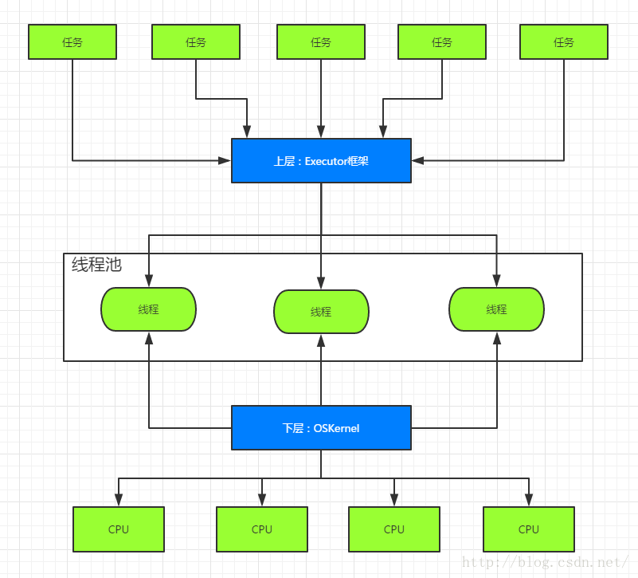
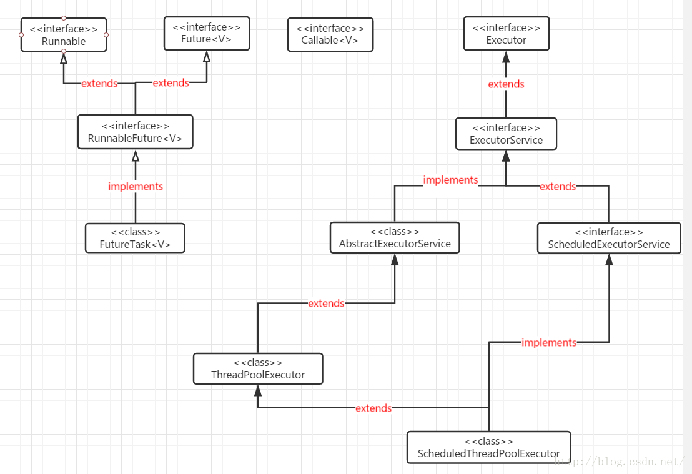
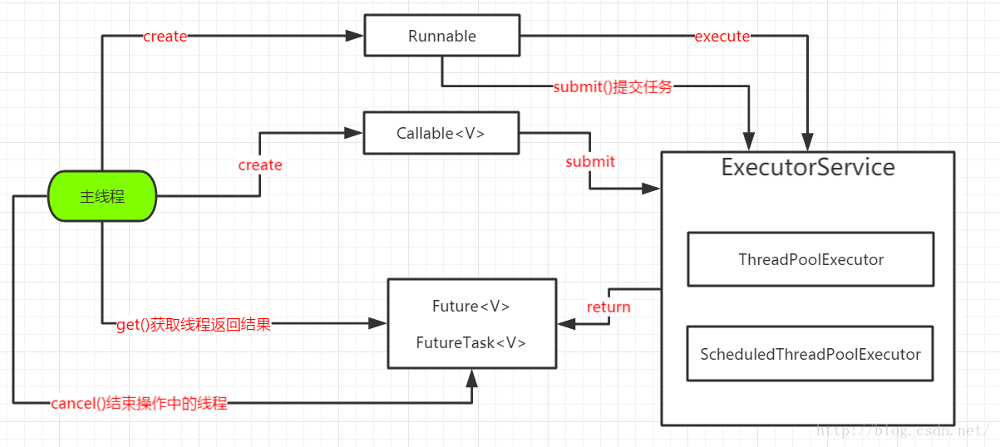
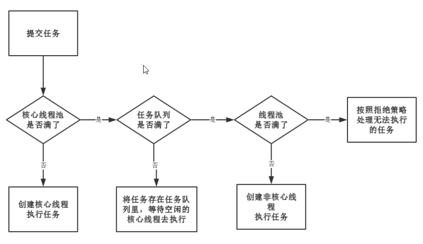

1. 两级调度模型  
   上层，Java多线程把程序分为若干任务，然后使用Executor框架把任务映射为固定数量的线程；   
   在底层，由操作系统把线程映射到硬件上
      
   
***
2.  Executor框架结构  
    
* **任务创建**——任务需要实现接口Runnable或Callable   
* **任务的执行**——执行机制的核心接口Executor，
  以及继承自Executor的EexcutorService接口。
  Exrcutor有两个关键类实现了ExecutorService接口
  (ThreadPoolExecutor和ScheduledThreadPoolExecutor)
*  **执行的结果**——Runnable任务无结果，Callable任务才有结果，
   执行的结果存储在Future或FutureTask中
    

***
3. ThreadPool
```
public ThreadPoolExecutor(int corePoolSize,
                              int maximumPoolSize,
                              long keepAliveTime,
                              TimeUnit unit,
                              BlockingQueue<Runnable> workQueue,
                              ThreadFactory threadFactory,
                              RejectedExecutionHandler handler) 
```
* **corePoolSize** : 线程池的核心线程数，默认情况下，核心线程数会一直在线程池中存活，即使它们处理闲置状态。
* **maximumPoolSize** : 线程池所能容纳的最大线程数量(核心线程数+非核心线程数)
* **keepAliveTime** : 非核心线程闲置时的超时时长，超过这个时长，非核心线程就会被回收。
  当 ThreadPoolExecutor的allowCoreThreadTimeOut属性设置为true时，keepAliveTime同样会作用于核心线程。
* **unit** : keepAliveTime的单位
* **workQueue** : 任务队列，提交到ThreadPool的任务会在存储在任务队列
* **threadFactory** : 线程工厂，为线程池提供创建新线程的功能
* **handler** : 拒绝策略，表示当 ThreadPoolExecutor已经关闭或者 ThreadPoolExecutor已经饱和时（达到了最大线程池大小而且工作队列已经满），
  execute方法将会调用Handler的rejectExecution方法来通知调用者，默认情况 下是抛出一个RejectExecutionException异常

    

***
接下来介绍几种常见的线程池(都是基于ThreadPool)
* FixedThreadPool
* CachedThreadPool
* ScheduledThreadPool
* SingleThreadExecutor