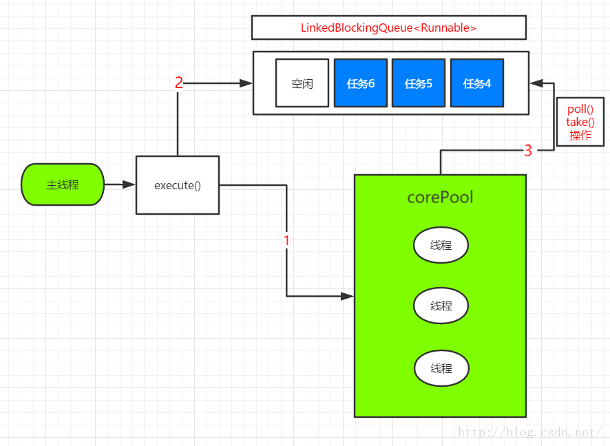

1. 构造方法
```

public static ExecutorService newFixedThreadPool(int nThreads) {
        return new ThreadPoolExecutor(nThreads, nThreads,
                                      0L, TimeUnit.MILLISECONDS,
                                      new LinkedBlockingQueue<Runnable>());
    }


//创建FixedThreadPool
ExecutorService fixedThreadPool=Executors.newFixedThreadPool(5);
```
* 特点
  * 通过构造方法，我们发现FixedThreadPool没有非核心线程,全是核心线程
  * LinkedBlockingQueue的容量为Integer.MAX_VALUE,所以不会调用拒绝方法  
    

当我们创建一个任务，然后执行execute()时
* 如果线程池中的核心线程数<最大线程数，那么创建一个核心线程来执行任务(直接执行1)
* 如果线程池中的核心线程数=最大线程数，那么任务放入LinkedBlockingQueue(执行2),
  核心线程执行完1后，会去LinkedBlockingQueue取任务来执行(执行3)