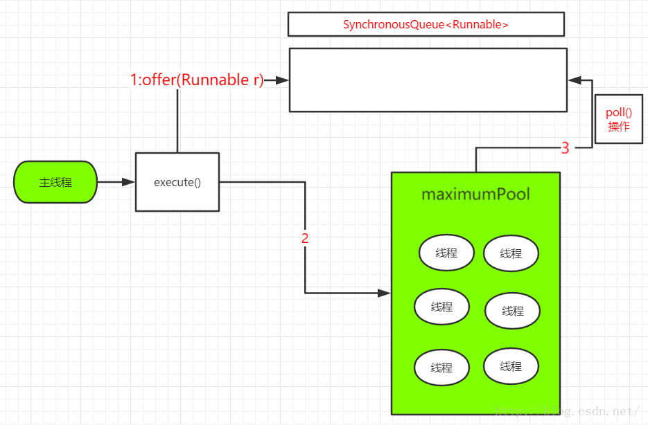

```

public static ExecutorService newCachedThreadPool() {
        return new ThreadPoolExecutor(0, Integer.MAX_VALUE,
                                      60L, TimeUnit.SECONDS,
                                      new SynchronousQueue<Runnable>());
                                      
//创建CachedThreadPool
ExecutorService cachedThreadPool=Executors.newCachedThreadPool(); 
```
* 特点
   * 核心线程数为0，线程池中只有非核心线程，并且存活时间为60s
   * 使用没有容量的SynchronousQueue作为任务队列 


* 使用过程

      

主线程创建一个任务，调用线程池的exxcute()时
* 主线程会调用SynchronousQueue.offer(),将任务放入SynchronousQueue
   * 如果此时，线程池中存在空闲线程，那么该空闲线程就会调用SynchronousQueue.poll()取得任务，然后执行该任务
   * 如果此时，线程池中不存在空闲线程，那么会创建一个新线程，新线程也是通过poll()取得任务，然后执行该任务   
