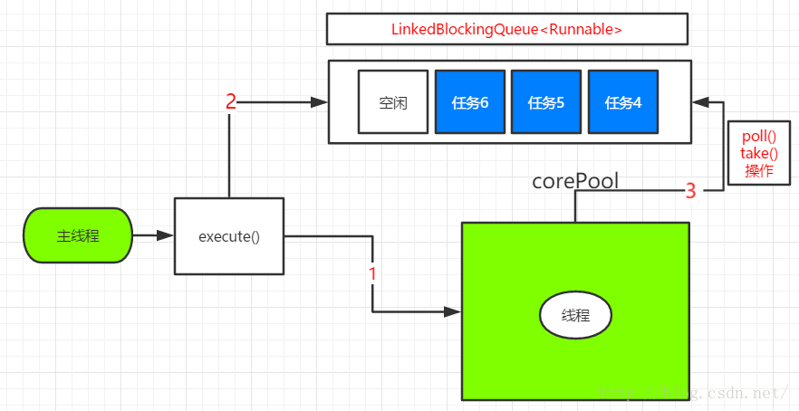

```
public static ExecutorService newSingleThreadExecutor() {
        return new FinalizableDelegatedExecutorService
            (new ThreadPoolExecutor(1, 1,
                                    0L, TimeUnit.MILLISECONDS,
                                    new LinkedBlockingQueue<Runnable>()));
    }

//创建
ExecutorService singleThreadExecutor=Executors.newSingleThreadExecutor(); 
```
* **特点**
   * 只有1个核心线程，如果多个任务被提交给SingleThreadExecutor的话，
     那么这些任务会被保存在一个队列中，并且会按照任务提交的顺序，
     一个先执行完成再执行另外一个线程。
     SingleThreadExecutor模式可以保证只有一个任务会被执行。
     这种特点可以被用来处理共享资源的问题而不需要考虑同步的问题。


* **执行过程**

      

* 主线程创建一个任务，然后调用线程池的execute()时  
  * 如果线程池中唯一的线程空闲，那么直接执行任务
  * 如果不空闲，放入LinkedBlockingQueue中，当线程空闲时，从LinkedBlockingQueue中取出任务执行    