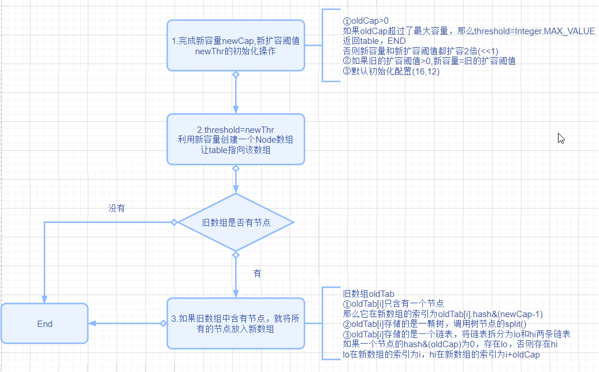
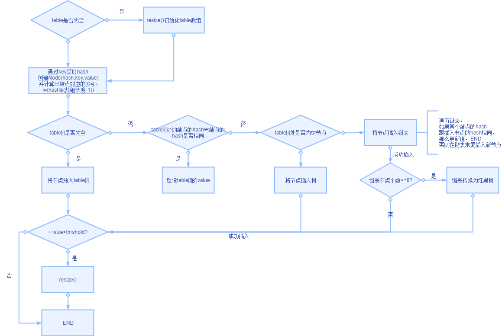

1. **属性值 **  

   *  **static final int DEFAULT_INITIAL_CAPACITY = 1 << 4**    

     数组默认大小16，构造方法没有传入capacity时默认使用这个变量

   *  **static final float DEFAULT_LOAD_FACTOR = 0.75f**

     负载因子默认大小，构造方法没有传入负载因子时默认使用该变量

   *  **static final int TREEIFY_THRESHOLD = 8**  

     链表转换为红黑树的阈值，链表长度>8转化为红黑树  

   *  **static final int UNTREEIFY_THRESHOLD = 6**

     红黑树退化为链表的阈值，红黑树节点个数<8退化为链表   

     

     **以上为默认常量**

     ------

     

   *  **transient Node<K,V>[] table** 

     存储节点的数据，table[i]可能为null，可能为链表，可能为红黑树

   *  **transient int size**

     HashMap中的节点个数

   *  **int threshold**

     数组扩容阈值，当节点数目>=threshold时，数据扩容

     如果构造方法传入了capacity,那么threshold=capacity*负载因子

     如果构造方法没有传入capacity，那么thrshold=16*负载因子

   * **final float loadFactor**

     负载因子，如果构造方法传入参数，则初始化为构造方法传入的值

     否则，初始化为0.75(上述默认的负载因子常量)；

   

2. **哈希函数**   

   ```
   static final int hash(Object key) {
           int h;
           return (key == null) ? 0 : (h = key.hashCode()) ^ (h >>> 16);
       }
   ```

   获取通过key.hashCode()获取默认哈希值h,然后 h异或h>>16

   put(key,value)的时候，通过key计算的hash，然后利用hash，key，value创建node

3. **构造方法**  

   构造方法可以传入capcity或负载因子

   但是构造方法调用完成后，完成对 负载因子，threshold的初始化，**并不对table初始化**

4. **扩容方法**   
   

**思考：扩容为什么是2倍**   
* <<1,位运算速度快
* 扩容的时候，如果oldTab[i]为链表，那么链表一分为二，一条在newTab[i],另一条在newTab[oldCap+i]   
  扩容2倍，可以让原来位于oldTab[i]的结点，在新链表中计算位置时，得到的结果为i或oldCap+i,提高扩容的效率
   
5. **put**
     
   
***
**JDK1.7的实现**
* 构造方法中会对table数组进行初始化
* 数据结构只用了数组链表，put简单很多 

