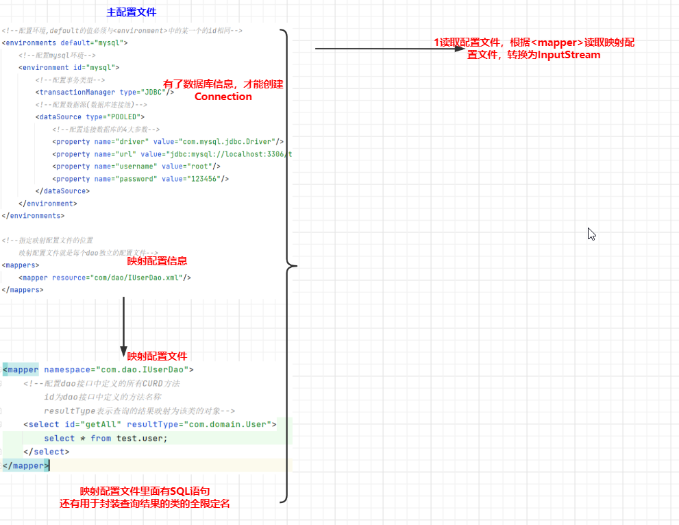
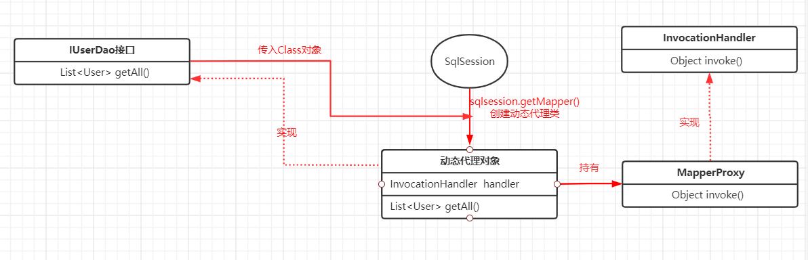
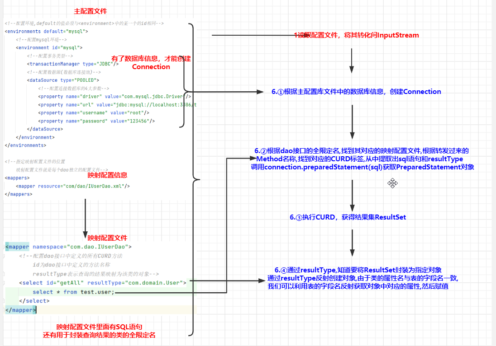

**实现CURD的操作过程如下**
```
        //1读取主配置文件,根据主配置文件中的<mapper>定件位并读取映射配置文,所以in包含了主配置文件和映射配置文件信息
        InputStream in = Resources.getResourceAsStream("SqlConfig.xml");
        //2创建一个SqlSessionFactoryFactoryBuilder实例
        SqlSessionFactoryBuilder builder=new SqlSessionFactoryBuilder();
        //3利用in创建SqlSessionFactory
        SqlSessionFactory factory=builder.build(in);这里使用了构建者模式
        //4创建SqlSession对象
        SqlSession sqlSession=factory.openSession();这里使用了工厂模式
        //5使用SqlSession对象创建dao接口的代理对象
        IUserDao course_wareDao=sqlSession.getMapper(IUserDao.class);这里使用了动态代理
        //6使用代理对象执行方法
        List<User>list=course_wareDao.getAll();
        for(User c:list){
            System.out.println(c);
        }
        //7释放资源
        sqlSession.close();
        in.close();
```
***
**接下来让我们详细看看操作过程及其背后的原理**

1. 读取主配置文件,根据主配置文件中的<mapper>定件位并读取映射配置文件,所以in包含了主配置文件和映射配置文件信息
   


2. 创建一个SqlSessionFactoryFactoryBuilder实例
3. 利用in创建SqlSessionFactory
4. 创建SqlSession对象
5. **最关键**——利用SqlSession创建dao接口的代理对象  
      
   通过**sqlsession.getMapper(IUserDao.class);**创建动态代理对象(通过jdk动态代理),创建出来的动态代理对象持有MapperProxy实例  
   我们对动态代理对象getAll()的调用会被拦截下来,转发给MapperProxy的invoke()方法

6. 使用代理对象执行方法  
   我们对代理对象getAll()的调用会被拦截下来，转发给MapperProxy的invoke(),invoke()中会进行如下操作  
     
   ①根据主配置库文件中的数据库信息，创建Connection  
   ②根据dao接口的全限定名,找到其对应的映射配置文件,根据转发过来的Method名称,找到对应的CURD标签,从中提取出sql语句和resultType  
   调用connection.preparedStatement(sql)获取PreparedStatement对象  
   ③执行CURD，获得结果集ResultSet   
   ④通过resultType,知道要将ResultSet封装为指定对象  
   通过resultType反射创建对象,由于类的属性名与表的字段名一直,我们可以利用表的字段名反射获取对象中对应的属性,然后赋值

7. 关闭资源