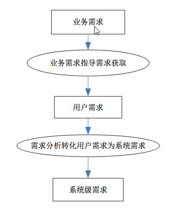

1. 什么是需求  
 需求是用户的一种**期望**，软件系统通过满足用户的期望来解决用户的问题  

***
2. 需求的层次性

```
R2:系统使用三个月后，销售额度提升20%(业务需求)
R3:系统要帮助收银员完成销售处理(用户需求)
R4:收银员输入购买商品的表识和数量时，系统要显示该商品的描述，单价，数量和总价(系统需求)
```

    

* 业务需求  
  ——描述了为什么要开发系统   
  ——**一个业务需求——>多个系统特性**  
  ```
  对于业务需求R2：系统使用三个月后，销售额度提升20%——我们可以得到多个系统特性
  SF1:管理会员信息
  SF2:提供会员服务
  SF3:使用多样化的特价方案，吸引顾客购买，增加销售额
  SF4:使用多样化的赠送方案，吸引顾客购买，增加销售额
  ```
* 用户需求  
  ——描述系统能为用户做些什么   
  ——**一个系统特性—>多个用户需求**    
  ```
  对于系统特性SF1：管理会员信息——我们可以得到多个用户需求
  UR1.1:系统应该允许客户经历添加，删除，修改客户信息
  UR1.2:系统应该记录会员的购买记录
  UR1.3:系统应该允许客户经理查看会员的个人信息和购买信息
  UR1.4:系统应该允许客户经理查看所有会员的统计信息
  ```
   
* 系统级需求  
  ——定义了系统中需要实现的功能，描述开发人员要实现什么  
  ——**一个用户需求—>多个系统级需求**  
  ```
  对于用户需求UR1.3:系统应该允许客户经理查看会员的个人信息和购买信息——我们可以得到多个系统级需求  
  SR1.3.1:接到客户经理的请求后，系统应该为客户经理提供所有会员的个人信息
  SR1.3.2:在客户经历输入会员的客户编号时，系统要提供该会员的个人信息
  SR1.3.3:在客户经历选定一个会员并申请查看购买记录时，系统要提供该会员的历史购买记录
  ``` 
  
* 结合层次性的需求开发
     
  
***
3. 需求分类   


**分类方式1**
* 需求 
  * 项目需求
  * 过程需求
  * 系统需求
    * 软件需求
    * 硬件需求
    * 其他需求
* 不切实际的期望
```
项⽬需求
• R5：项⽬的成本要控制在60万元⼈⺠币以下。
• R6：项⽬要在6个⽉内完成。
过程需求
• R7：在开发中，开发者要提交软件需求规格说明⽂档、设计描述⽂档和测试报告。
• R8：项⽬要使⽤持续集成⽅法进⾏开发。
其他需求
• R9：系统要购买专⽤服务器，其规格不低于….。
• R10：系统投⼊使⽤时，需要对⽤户进⾏1个星期的集中培训
不切实际的期望
• R11：系统要分析会员的购买记录，预测该会员将来⼀周和⼀个⽉内会购买的商品；
• R12：系统要能够对每⽉的出⼊库以及销售⾏为进⾏标准的财务分析；
• R13：在使⽤系统时，收银员必须要在2个⼩时内完成⼀个销售处理的所有操作。
正确的形式
• R14：如果⼀个销售处理任务在2个⼩时内没有完成，系统要撤销该任务的所有已执
⾏操作
```

**分类方式2**  
* 功能需求
  * 功能需求(最重要)
  * 数据需求  
* 非功能需求
   * 性能需求
   * 质量属性
   * 对外接口
   * 约束 