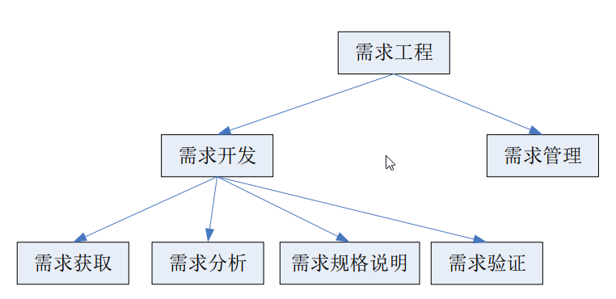

***
1. 需求工程的概念   
   所有需求处理活动的总和。  
   它收集信息、分析问题、整合观点、记录需求并验证其正确性，最终描述出软件被应⽤后与其环境互动形成的期望效应

2. 需求工程的活动   
   
    * 需求开发
        * 需求获取
            * 目标分析
            * 用户需求获取
        * 需求分析(通过建模来整合信息)
            * 分界分析——定义项目的范围，一般使用**用例图**，**上下文**
            * 需求建模——为了展示和解释信息而进行的抽象活动，常用数据流图，实体关系图，状态转换图，类图等
        * 需求规格说明——写需求文档
            * 定制文档模板
            * 编写文档
        * 需求验证
            * 同级评审
            * 原型
            * 模拟
    * 需求管理——保证需求作⽤的持续、稳定和有效发挥；进⾏变更控制

***