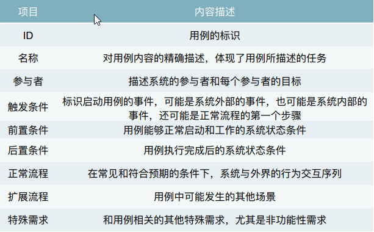

**1. 需求分析(通过建模来整合信息)**    
* 分界分析——定义项目的范围，一般使用**用例图**，**上下文**
* 需求建模——为了展示和解释信息而进行的抽象活动，常用数据流图，实体关系图，状态转换图，类图等   
  

* **常见的需求分析模型**  
  * **结构化方法** 
    * **数据流图**
    * **实体关系图**  
  * **面向对象方法**  
    * **用例图**
    * **类图**
    * **顺序图**
    * **状态图**
    
***
**2. 用例图**  
* **用例图基本元素**  
   * 用例
   * 参与者
   * 关系
   * 系统边界 
  
* **用例模板**
    
  
***
**3. 概念类图**
