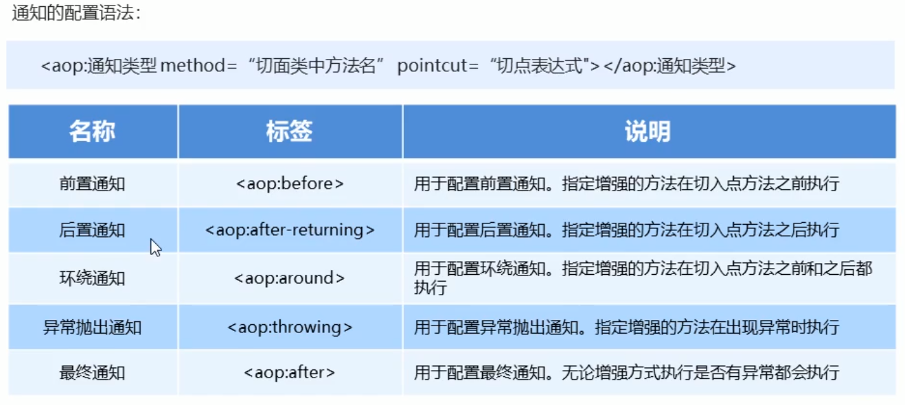

**一.xml实现AOP大致流程**  
1.创建业务接口和业务实现类(含有Pointcut)  
2.创建切面类(功能增强类,含有advacne)  
3.在xml配置weaving关系——告诉Spring容器,哪个Bean的哪个方法是Pointcut,这个Pointcut要匹配哪个advance,以及advance的类型
***
**二.xml中配置weaving关系**  
1.<beans>的加入**xmlns:aop属性**,**xsi:schemaLocation属性**添加一句
```
<beans xmlns="http://www.springframework.org/schema/beans"
       xmlns:xsi="http://www.w3.org/2001/XMLSchema-instance"
加入这句 xmlns:aop="http://www.springframework.org/schema/aop" 
       xsi:schemaLocation=
       "http://www.springframework.org/schema/beans http://www.springframework.org/schema/beans/spring-beans.xsd
加入这句  http://www.springframework.org/schema/aop http://www.springframework.org/schema/aop/spring-aop.xsd  
">
```  
2.配置切面
><<aop:config>>
> ><<aop:aspect>>——配置切面
> > > ref——切面类的id  
> > ><<aop>aop>——设置advance为切面类中的哪个方法,设置通知类型,设置Pointcut(切点表达式)

**<aop<aop>>的格式如下**  
<aop:通知类型 method="xx" pointcut="切点表达式">

* 通知类型      
  前置通知 <<aop:before>>——代理对象中,advance在Pointcut之前执行  
  后置通知 <<aop:after-returning>>——代理对象中,advance在Pointcut之后执行,如果advance执行前抛出异常,advance不执行  
  环绕通知 <<aop:around>>——<a herf="#around">看这里,详细解释</a>  
  异常抛出通知 <<aop:throwing>>——  
  最终通知 <<aop:after>>——
* method——表明advance是切面类中的哪个方法
* 切点表达式

<a name="around">**xml环绕通知详解**</a>